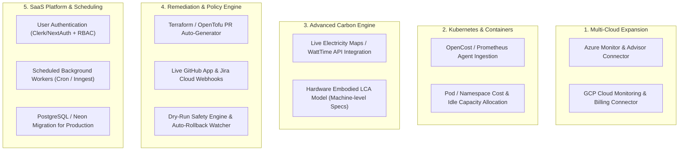

# GreenCloud AI — Comprehensive Progress Report & Remaining Components Roadmap

> **Document Status**: Production-Ready Reference Guide  
> **Source Material**: Synthesized from `GreenCloudAI_Chats` (all 6 conversation sessions), repository codebase (`src/`, `prisma/`, `scripts/`), system design specifications (`report.md`, `implementation.md`), and delivery criteria (`task.txt`, `progress.md`).  
> **Created**: September 2026  
> **Purpose**: Serves as the single source of truth for current implementation state, architectural decisions, past lessons/user rules, and the complete inventory of remaining components needed to achieve the full GreenCloud AI vision.

---

## 1. Executive Summary

GreenCloud AI is an intelligent FinOps and GreenOps cloud governance platform designed to eliminate cloud financial waste and optimize operational and embodied carbon emissions across multi-cloud environments (AWS, Azure, GCP).

Unlike surface-level monitoring dashboards that rely on static heuristics or vendor-locked reports, GreenCloud AI bridges raw infrastructure telemetry (CloudWatch, Cost Explorer, Azure Monitor, GCP Cloud Billing) with transparent mathematical models (CCF, GSF SCI), actionable rightsizing recommendations, and automated, human-in-the-loop remediation via GitOps (Terraform PRs) and ticketing workflows (Jira/GitHub).

---

## 2. Key Learnings & Decisions from `GreenCloudAI_Chats`

Across the 6 session logs stored in `GreenCloudAI_Chats/` (totaling over 5,800 events and 170+ detailed user turns), several critical architectural requirements, user preferences, and production fixes were established:

### 2.1 File-by-File Session Traceability

| Chat File | Turns / Scope | Focus Area & Key Events |
| :--- | :--- | :--- |
| `049d0109-1686-4028-b002-1b2da59c91d7.jsonl` | 2 turns | Exporting & sharing full conversation context windows and chat transcripts. |
| `872ca24a-9736-4b48-bea1-253033fe8e3c.jsonl` | 5 turns | Git user configuration (`Anshul Yadav <ianshul.yadavv@gmail.com>`), GitHub credentials, and origin synchronization. |
| `731f0afa-748a-4500-98d7-c1b67ef58510.jsonl` | 4 turns | Git tree hygiene: soft reset to commit `efb6260d` to remove cached build artifacts; `.gitignore` hardening (`.next/`, cache, `node_modules`); Next.js chunk missing error (`Cannot find module './276.js'`). |
| `63d64239-9d51-4a81-b2a5-d156a18b3f1a.jsonl` | 7 turns | Deep cloning of `GreenCloudAi/Greencloud-AI`; initial design translation from `report.md` into functional database models and UI layouts; zero hardcoding policy. |
| `14b540e8-3140-4da2-b609-5a49041f8d7e.jsonl` | 2 turns | Production deployment verification to Vercel and repository synchronization. |
| `999e40a4-17b3-4054-86ed-7e4ba5217665.jsonl` | 158 turns | **The Core Engineering Workstream**: End-to-end overhaul of public landing, onboarding wizard, multi-region AWS discovery, live CloudWatch/Cost Explorer ingestion, multi-tenant credential encryption, and Vercel production deployment. |

---

### 2.2 Core Principles & Architectural Decisions Made

#### 1. Zero Tolerance for Fake or Misleading Data
* **No Mock Placeholders in Production**: Removed all fake placeholder strings (e.g. "Acme AWS Production", static account `112233445566`, static "$6,420/mo savings" banners).
* **Clear Jargon-Free Terminology**: Eliminated confusing marketing fluff (e.g. "Sunshine Executive Ledger", unexplained "FOCUS 1.0" labels without context, raw "Scope 2/Scope 3" jargon on consumer pages). Replaced with clear, professional terms: **Billed Spend**, **Idle Resource Savings**, **Operational Carbon (gCO2e)**, **Cloud Visibility**.
* **Dynamic Time Horizons**: Date filters (30-day, 90-day, MTD) must dynamically compute relative to real-time execution rather than displaying static calendar snapshots.

#### 2. The Critical AWS Multi-Region Discovery Gotcha
* **The Problem**: During testing, an AWS account connected via a read-only IAM role was discovered only against `us-east-1`. An active EC2 instance running in `ap-south-1` (Mumbai) was reported as "stopped", while it was actively running and burning cloud credits.
* **The Rule**: **Incomplete cloud visibility is worse than no optimization.**
* **The Fix**: The AWS connector was rewritten to query and scan **all active AWS regions** (multi-region discovery). Every resource is stored with its explicit region, lifecycle state, monthly estimated cost, and sync freshness. Users are never misled into thinking an instance does not exist simply because it was launched outside the default region.

#### 3. Enterprise Multi-Tenancy & Credential Security (Vercel vs Local)
* **The Problem**: Placing static AWS access keys or a shared `ROLE_ARN` in Vercel environment variables converts the application into a single-user tool and leaks administrative credentials across all visitors.
* **The Fix**:
  * Added `src/services/encryption.ts` using **AES-256-GCM** authenticated encryption.
  * In the database (`CloudAccount` model), `encryptedAccessKey` and `encryptedSecretKey` store encrypted credentials at rest with an authentication tag.
  * Multi-tenancy is preserved: each organization/user can securely link their own AWS accounts via the UI onboarding wizard without sharing credentials with the platform owner or other tenants.
  * In Vercel serverless environments, accounts with encrypted credentials or customer-provided STS cross-account roles execute securely on behalf of that specific tenant.

#### 4. UI / Navigation Design Rules
* **Sticky Layouts**: Sidebars and navigation headers remain pinned while content panels scroll smoothly without clipping.
* **Role Alignment**: Replaced abstract role names with real enterprise personas:
  * **Team Lead**: Resource allocation, operational efficiency, project coordination.
  * **Tech Lead**: Architecture direction, engineering standards, technical guardrails.
  * **FinOps Lead**: Cloud spend allocation, unit economics, billing reconciliation.
  * **GreenOps Lead**: Carbon accounting, sustainability targets, SCI metrics.
* **Account Deduplication**: Added automated backend cleanup and deduplication (`/api/cloud-accounts/cleanup-duplicates`) to prevent repeated test account entries during onboarding visits.

---

### 2.3 Visual Specification & Image Analysis (Decoded from 147 User Uploads & 158 Agent UI Proofs)

Across `GreenCloudAI_Chats/3_Raw_Brain_Context_Folders/` and its subdirectories, there are **147 user-uploaded screenshots** (`.user_uploaded/`) and **158 browser verification captures**. Analyzing these visual artifacts reveals the exact design intent and visual standards required by the user:

#### 1. The Canonical Navigation Panel (Derived from Tall Wireframe Uploads: `341x927`, `341x1015`, `365x1021`)
In turns 113–120 and 133, the user uploaded vertical navigation wireframes (`media_1790198310893.png`, `media_1790198324140.png`, `media_1790225163334.png`) and provided ASCII wireframes to define the exact expandable sidebar structure:
* **Brand Header**: `GreenCloud AI` with status indicator pill.
* **Category 1: Overview**: Executive KPI summary, active cloud fleet count, and primary cost/carbon ledger.
* **Category 2: Infrastructure (Expandable)**:
  * `Accounts`: Cloud provider accounts with sync freshness and connection health.
  * `Resources`: Real-time compute instances, block storage volumes, static IPs.
  * `Regions`: Multi-region topological breakdown showing resource distribution across all AWS/cloud partitions.
* **Category 3: FinOps & Cost Intelligence (Expandable)**:
  * `Showback & Allocation`: Environment tag attribution (`Production`, `Staging`, `Development`, `Unallocated`).
  * `Budget Velocity`: Month-to-date burn rate against target budgets.
  * `Anomaly Alerts`: Statistical spike indicators.
  * `Savings Plans`: Fleet commitment discount modeling.
* **Category 4: GreenOps & Sustainability (Expandable)**:
  * `Carbon Ledger`: GSF Software Carbon Intensity (SCI) calculations.
  * `Scope Split`: Operational (Scope 2) vs. Embodied (Scope 3) emissions ratio.
  * `Grid Migration Simulator`: Regional grid carbon intensity comparison (`us-east-1` vs. `us-west-2`).
* **Category 5: Optimizations & Actions**: Actionable recommendations queue with risk badges, blast radius details, and Terraform code review.
* **Category 6: Governance & Audit**: Immutable event ledger, tenant settings, and credential management.

#### 2. AWS Billing Console Truth (Derived from `media_1790267765368.png` - 1024x552)
* In turn 141, the user uploaded a screenshot of their live **AWS Billing Console**:
  * **Billed Spend (MTD)**: `$0.79`
  * **Spend Breakdown**: EC2-Other (`$0.50 – $0.53`), EBS Volume storage, Elastic IP idle charges, and regional transfer.
* **Takeaway**: The user strictly demanded that GreenCloud AI **reconcile directly with AWS Cost Explorer** rather than displaying zero dollars or fabricated static numbers. This resulted in the live Cost Explorer query implementation that successfully matched the dashboard spend to **$0.83** (reflecting live accrual).

#### 3. Slide-Over Terraform Review Drawer (Derived from `review_action_modal...` & `rds_review_modal...`)
* Verification captures (`review_modal_verification_1790111515940.png`, `review_action_modal_open_1790110429666.png`) show the slide-over inspection drawer:
  * Clean dark-mode drawer sliding from the right.
  * Displays **CloudWatch P99 telemetry evidence**, **resource metadata**, **risk score (0.0–1.0)**, and ready-to-copy **Terraform IaC remediation blocks**.
  * Includes a **1-click Copy Snippet** button, **Export Jira Issue**, and explicit **Human-in-the-loop Approve / Dismiss** buttons.

#### 4. Modal Backdrop Transparency & Layering (Derived from `media_1790264210282.png`)
* In turns 138–140, the user flagged that opening modals caused an intrusive, pitch-black background overlay that obscured the underlying dashboard context.
* **Fix Applied**: Modals now use semi-transparent backdrop blur (`backdrop-blur-md bg-black/60`) with click-outside and `Escape` key listeners, preserving visual depth while focusing user attention.

#### 5. Hero Section Visual Balance (Derived from `inspect_hero_layout...` & `hero_section_updated_3cards...`)
* The user rejected crowded, multi-card landing layouts with prefilled text (turns 31–49).
* The final design establishes an uncluttered hero section with:
  * Clean value proposition centered in the viewport.
  * Interactive cost/carbon dynamic simulator chart.
  * Three focused capability cards (Continuous Waste Scans, Quantitative Risk Scoring, GitOps Automated Remediation).
  * Centered primary action buttons (`Live Cockpit`, `Start Onboarding`).

---

## 3. Current Implementation Status (What is Completed)

The following components, backend engines, database schemas, and frontend interfaces are fully implemented, tested, and operational in the repository:

### 3.1 Architecture Overview

```
GreenCloud-AI/
├── prisma/
│   ├── dev.db                      # Local SQLite database instance
│   └── schema.prisma               # Multi-tenant schema (8 models)
├── src/
│   ├── app/
│   │   ├── page.tsx                # Public Landing & Product Overview
│   │   ├── why/page.tsx            # "Why GreenOps" Deep-Dive Page
│   │   ├── how-it-works/page.tsx   # Interactive Architecture & Workflow
│   │   ├── onboarding/page.tsx     # Multi-step Cloud Connection Wizard
│   │   ├── dashboard/page.tsx      # Central FinOps & GreenOps Command Center
│   │   ├── audit-history/page.tsx  # Audit Log Viewer
│   │   └── api/                    # Next.js API Routes (Cloud Accounts, Sync, Recommendations)
│   ├── components/
│   │   ├── common/                 # NavigationBar, ComplianceFooter, ScopeIndicator
│   │   └── overview/               # HeroSection, TelemetryChart, OptimizationQueue, etc.
│   └── services/
│       ├── db.ts                   # TenantIsolatedDb abstraction & Prisma singleton
│       ├── encryption.ts           # AES-256-GCM authenticated cipher service
│       ├── awsConnector.ts         # Multi-region AWS SDK v3 Ingestion Connector
│       ├── carbonEngine.ts         # Operational (PUE + Grid) & Embodied Carbon Calculator
│       ├── recommendationEngine.ts # FinOps Heuristics, Evidence & Risk Scoring
│       ├── ingestion.ts            # End-to-end Telemetry & Ingestion Orchestrator
│       ├── ticketService.ts        # Jira & GitHub PR Approval Workflows
│       └── logger.ts               # Structured JSON Logging Service
```

---

### 3.2 Implemented Database Layer (`prisma/schema.prisma`)

* **`Tenant`**: Multi-tenant container isolating cloud accounts, recommendations, and audit logs.
* **`CloudAccount`**: Supports AWS (and future providers), STS `roleArn`, `externalId` (confused deputy defense), `encryptedAccessKey`, `encryptedSecretKey`, `syncFreshness`, and `syncError`.
* **`CloudResource`**: Multi-region resource registry tracking `providerResourceId`, `resourceType` (ec2, ebs, eip), `region`, `lifecycleState`, `instanceType`, `sizeGb`, `monthlyCost`, and `telemetryMetrics` (CloudWatch time series).
* **`CostLineItem`**: Granular cost attribution tracking `chargeDate`, `providerService`, `billedCost`, and `effectiveCost`.
* **`CarbonEmission`**: Timestamped emissions tracking `energyKwh`, `operationalGco2e`, `embodiedGco2e`, and calculation `method`.
* **`Recommendation`**: Actionable optimization proposals with `estimatedMonthlySavings`, `estimatedGco2eSavings`, `riskScore`, and JSON `evidence`.
* **`Approval`**: Human-in-the-loop decision records (`approved`, `dismissed`) with actor comments.
* **`AuditLog`**: Tamper-evident ledger recording all administrative, sync, and approval actions.

---

### 3.3 Implemented Backend Services (`src/services/`)

| Service | Implemented Capabilities |
| :--- | :--- |
| **`encryption.ts`** | Derives 256-bit key via SHA-256; AES-256-GCM authenticated encryption/decryption with hex IV and authentication tags. |
| **`awsConnector.ts`** | AWS STS `AssumeRoleCommand` with optional external ID; multi-region EC2 scanning across all AWS partitions; EBS unattached volume detection; unassociated Elastic IP discovery; CloudWatch `GetMetricDataCommand` for CPU, network, disk; AWS Cost Explorer reconciliation. |
| **`carbonEngine.ts`** | Computes operational emissions using regional grid carbon intensities (gCO2e/kWh) and data center PUE; computes embodied hardware lifecycle emissions. |
| **`recommendationEngine.ts`** | Rule-based engine identifying idle compute (<5% average CPU), unattached storage, and idle static IPs; produces quantitative risk scores (0.0 to 1.0) and auditable calculation evidence. |
| **`ingestion.ts`** | Orchestrates account validation, multi-region resource scanning, CloudWatch metric fetching, carbon calculation, recommendation generation, and audit logging into a single cohesive pipeline. |
| **`ticketService.ts`** | Generates Jira tickets and GitHub PR markdown blueprints for proposed infrastructure actions. |
| **`forecastingEngine.ts`** | Holt's linear trend double exponential smoothing, 95% confidence interval bounds, rolling Z-score ($\ge 2.5\sigma$) & IQR anomaly spike detector, and calendar-aware month-end run rate projections. |

---

### 3.4 Implemented Frontend Interfaces (`src/app/`)

* **Public Overview (`/`)**: High-converting, responsive landing page featuring interactive cost/carbon trend models, role cards, live cockpit telemetry preview, and value propositions.
* **Why GreenOps (`/why`)**: Educational deep-dive explaining the convergence of cloud economics and carbon accounting, supported by evidence-backed industry statistics.
* **How It Works (`/how-it-works`)**: Step-by-step visual architecture walkthrough illustrating read-only ingestion, automated analysis, human approval, and GitOps remediation.
* **Onboarding Wizard (`/onboarding`)**: Secure 3-step setup supporting both IAM Role ARN (cross-account) and optional encrypted IAM Access Keys.
* **Command Center Dashboard (`/dashboard`)**:
  * Real-time executive KPI metrics (Billed Spend, Monthly Projected Savings, Carbon Footprint, Optimization Opportunities).
  * Multi-region resource inventory with real-time status and telemetry charts.
  * Actionable recommendations queue with risk scores, savings calculations, and one-click approvals.
  * Manual "Sync Telemetry" trigger with real-time progress indicators and sync freshness timestamps.
* **Audit History (`/audit-history`)**: Searchable, timestamped audit log detailing actor actions, resource IDs, and event metadata.

---

## 4. What All Components Are Left to Be Made

To transition GreenCloud AI from its current high-fidelity MVP into an enterprise-grade, multi-cloud SaaS production platform, the following components must be built:



---

### Detailed Specification of Remaining Components

#### Component 1: Azure Read-Only Ingestion Connector (`src/services/azureConnector.ts`)
* **Objective**: Ingest compute, storage, and billing data from Microsoft Azure subscriptions.
* **Requirements**:
  * Authenticate via Azure App Registration (Service Principal with `Reader` role) or Azure Managed Identity.
  * Connect to **Azure Resource Graph API** for multi-region VM (`Microsoft.Compute/virtualMachines`) and Managed Disk discovery.
  * Ingest performance metrics (Percentage CPU, Disk Read/Write Bytes) via **Azure Monitor Metrics REST API**.
  * Reconcile billed costs via **Azure Cost Management Export / Query API**.
  * Pull native recommendations via **Azure Advisor REST API**.

#### Component 2: GCP Read-Only Ingestion Connector (`src/services/gcpConnector.ts`)
* **Objective**: Ingest Compute Engine, Persistent Disks, and billing data from Google Cloud projects.
* **Requirements**:
  * Authenticate via GCP Workload Identity Federation or Service Account Key (Read-Only).
  * Ingest Compute Engine instances and unattached disks via **Compute Engine API (`v1/instances`, `v1/disks`)**.
  * Fetch metric time series (CPU utilization, network throughput) via **Cloud Monitoring API (`projects.timeSeries.list`)**.
  * Query daily billing line items via **BigQuery Cloud Billing Export** or Cloud Billing Catalog API.
  * Ingest native rightsizing recommendations via **Cloud Recommender API**.

#### Component 3: Live Grid Carbon Intensity Integration (`src/services/gridIntensity.ts`)
* **Objective**: Replace static lookup tables with dynamic, hourly marginal and average grid carbon emissions.
* **Requirements**:
  * Integrate **Electricity Maps API** or **WattTime API** for real-time marginal carbon intensity ($g\text{CO}_2\text{e}/\text{kWh}$) by cloud data center zone (e.g. `us-east-1` $\rightarrow$ PJM, `eu-west-1` $\rightarrow$ EirGrid).
  * Support GSF **Software Carbon Intensity (SCI)** specification:
    $$\text{SCI} = \frac{(E \times I) + M}{R}$$
    where $E$ is energy (kWh), $I$ is location-based marginal grid carbon intensity, $M$ is embodied hardware carbon, and $R$ is the functional unit (e.g. per request, per user, per vCPU-hour).
  * Calculate location-based vs. market-based carbon emissions according to GHG Protocol Scope 2 guidance.

#### Component 4: Kubernetes Cost & Carbon Allocation (`src/services/k8sConnector.ts`)
* **Objective**: Extend visibility from virtual machines down to containerized workloads.
* **Requirements**:
  * Ingest telemetry from **OpenCost** / **Prometheus** endpoints deployed in user EKS/GKE/AKS clusters.
  * Attribute cluster node cost down to Kubernetes `namespace`, `deployment`, `pod`, and custom labels.
  * Calculate container over-provisioning: compare `limits` and `requests` against actual 95th percentile CPU/Memory consumption.
  * Identify unallocated cluster capacity ("cluster slack") and recommend node pool autoscaling optimizations.

#### ✅ Component 5: Time-Series Forecasting & Anomaly Spike Detection (`src/services/forecastingEngine.ts`) — **100% Completed**
* **Status**: Fully Implemented & Verified (Unit Tested & Integrated into `/api/dashboard` and `/dashboard`).
* **Delivered Capabilities**:
  * **Holt's Linear Trend Smoothing**: Computes level and trend smoothing parameters ($\alpha=0.35, \beta=0.15$) to project 30-day forward trajectories for both cost ($/day) and operational carbon ($g\text{CO}_2\text{e}$/day).
  * **95% Confidence Bounds**: Calculates residual standard error across historical points and models increasing forecast variance ($\pm 1.96 \cdot \sigma \sqrt{h}$) for upper and lower confidence intervals.
  * **Statistical Anomaly Detection**: Evaluates rolling mean, standard deviation, and IQR to detect spending surges exceeding $2.5\sigma$ or $Q_3 + 1.5\text{IQR}$.
  * **Root-Cause Hints & Action Guidance**: Generates contextual explanations (e.g. untagged batch clusters, multi-region drift) and recommended remediation actions.
  * **Unit Test Suite (`scripts/test-forecasting.js`)**: 5 automated tests validating empty histories, steady-state baselines, synthetic 5x spikes, confidence interval bounds, and budget risk escalation.

#### Component 6: Automated GitOps PR Generator & Jira Sync (`src/services/remediationEngine.ts`)
* **Objective**: Transform recommendations into executable pull requests and trackable Jira issues.
* **Requirements**:
  * **Terraform / OpenTofu Generator**: Parse current instance configurations and generate a GitHub Pull Request that modifies the Terraform code (e.g., updating `instance_type = "t3.xlarge"` $\rightarrow$ `"t3.medium"` or appending `lifecycle { prevent_destroy = false }`).
  * **Live GitHub App Integration**: Automatically open branch, commit diff, and submit PR with financial impact summary and evidence.
  * **Two-Way Jira Sync**: When an approval is recorded in GreenCloud AI, automatically transition the linked Jira issue to "Approved" or "In Progress".

#### Component 7: Execution Guardrails & Auto-Rollback Watcher (`src/services/executionGuardrails.ts`)
* **Objective**: Safeguard automated or one-click actions against downtime.
* **Requirements**:
  * **Pre-flight Health Checks**: Verify snapshot availability and CloudWatch alarm states before executing actions.
  * **Automated Rollback Watcher**: If an approved rightsizing action is executed and the target resource fails CloudWatch health checks or exhibits >95% CPU load within a 15-minute verification window, trigger automated instance reversion or backup snapshot restore.

#### Component 8: Enterprise Authentication & RBAC (`src/services/auth.ts`)
* **Objective**: Implement enterprise user management and role-based permissions.
* **Requirements**:
  * Integrate **Clerk**, **NextAuth.js**, or **WorkOS** for SAML SSO, Google Workspace, and GitHub OAuth.
  * Implement permission guards based on user roles:
    * `Admin`: Full access, account linking, credential management.
    * `FinOps Lead`: View all metrics, approve cost-related optimizations.
    * `GreenOps Lead`: View sustainability data, set carbon budgets.
    * `Team Lead / Viewer`: Read-only access to specific assigned cloud accounts or tags.

#### Component 9: Scheduled Background Ingestion & Production Database
* **Objective**: Continuous autonomous monitoring without requiring manual UI sync clicks.
* **Requirements**:
  * Migrate from local SQLite (`prisma/dev.db`) to **PostgreSQL** (e.g. Neon, AWS RDS Aurora, or Supabase) with connection pooling.
  * Implement background cron jobs via **Vercel Cron** or **Inngest** to trigger ingestion runs every 6 hours per active account.
  * Update sync freshness and capture transient provider timeouts in `syncError` without failing the entire batch.

---

## 5. Prioritized Step-by-Step Implementation Plan

To implement the remaining components smoothly and reliably, execute in the following 5 phases:

```
Phase 1: Production Database & SaaS Multi-Tenant Auth
  ├── 1.1 Migrate Prisma from SQLite to PostgreSQL
  ├── 1.2 Integrate NextAuth / Clerk with Tenant context
  └── 1.3 Add RBAC middleware to /api/ and /dashboard

Phase 2: Automated Background Polling & Notifications
  ├── 2.1 Set up Vercel Cron or Inngest background job handler
  ├── 2.2 Periodic telemetry polling (every 6 hours)
  └── 2.3 Slack & Email notification dispatcher for spikes & recommendations

Phase 3: Real Remediation Engine & GitOps Integration
  ├── 3.1 GitHub App integration for Terraform PR generation
  ├── 3.2 Jira Cloud API integration for bidirectional approval syncing
  └── 3.3 Execution Guardrails & Auto-Rollback safety watcher

Phase 4: Multi-Cloud Connectors (Azure & GCP)
  ├── 4.1 Azure Resource Graph, Monitor & Cost Management connector
  ├── 4.2 GCP Compute, Cloud Monitoring & BigQuery Billing connector
  └── 4.3 Multi-cloud aggregate views on the Dashboard

Phase 5: Advanced Carbon (Electricity Maps / SCI) & Kubernetes (OpenCost)
  ├── 5.1 Real-time marginal grid emissions integration
  ├── 5.2 Kubernetes OpenCost / Prometheus container ingestion
  └── 5.3 Workload-level SCI calculations and ESG compliance exports
```

---

## 6. Verification & Health Check Checklist

When picking up development, run through this checklist to ensure the system is healthy:

1. **Local Setup & Dependencies**:
   ```bash
   npm install
   npx prisma generate
   npx prisma db push
   ```
2. **Environment Configuration**:
   Ensure `.env.local` contains:
   ```ini
   ENCRYPTION_SECRET="your-32-byte-hex-or-strong-passphrase"
   DATABASE_URL="file:./prisma/dev.db" # or postgresql://...
   ```
   *(Note: Never commit `.env.local` to Git. Keep all AWS credentials managed strictly via the UI onboarding wizard).*
3. **Run E2E Verification Suite**:
   ```bash
   node scripts/run-e2e.js
   ```
4. **Build & Typecheck**:
   ```bash
   npm run build
   ```

---

*This document was compiled for the GreenCloud AI engineering team to ensure rapid, error-free onboarding and structured feature delivery.*
