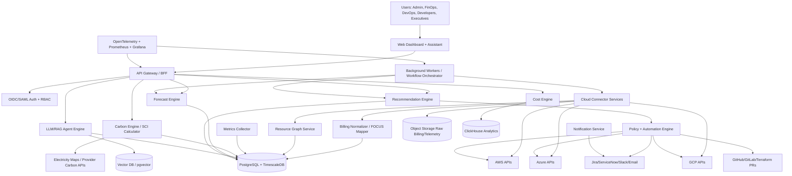

# Greencloud
Welcome to our project 
GreenCloud is a proposed FinOps and GreenOps platform for understanding and reducing cloud cost and cloud-related emissions. It is intended to connect cloud billing, resource inventory, utilization telemetry, and carbon-intensity data; then produce evidence-backed recommendations that people can approve and execute safely.

## Authors & Contributors

- **Anshul Yadav**
- **Anjishnu Srivastava**
- **Anubhav Bansal**
- **Aru Pandey**

---

## 1. What Problem Does It Solve?

Cloud is easy to start, hard to control.
- Engineers launch VMs, Kubernetes pods, disks, DBs, load balancers and forget them → you keep paying.
- Kubernetes requests are too big (to avoid crashes) → 40-60% waste.
- Bills arrive after 24h-48h → surprise at month-end.
- Carbon reports differ per provider, no trust score, no per-feature carbon.
- Existing tools (CloudHealth, CloudZero, Kubecost, Flexera, Harness, CAST AI) show dashboards but don't close the loop with safe automation + carbon-aware scheduling + evidence.

**GreenCloud AI is the decision system that answers:**
1. What are we spending? Who owns it?
2. What is idle/oversized/risky/carbon-intensive?
3. What will demand look like next week?
4. What action saves most $ and gCO2e with lowest risk?
5. Can we safely create a PR / Jira ticket / execute with guardrails and rollback?

**Product goal:**
Help FinOps, DevOps, engineering, and sustainability teams answer:

1.What is being spent, by whom, on what, and why?
2.Which resources are idle or oversized?
3.What can be changed safely, how much could it save, and what evidence supports it?
4.What is the operational carbon estimate, what method produced it, and how reliable is the estimate?
5.Which recommendations should be reviewed, turned into tickets or pull requests, or eventually automated?

---

## 2. Core Features

| Category | Feature |
|---|---|
| **Ingestion** | AWS CUR + Cost Explorer + CloudWatch + Compute Optimizer + Carbon tool, Azure Cost Management + Advisor + Resource Graph, GCP Billing Export + Recommender + Carbon Footprint |
| **Normalization** | FOCUS-compatible schema (FinOps Open Cost and Usage Spec) [1](https://focus.finops.org/focus-specification/v1-3/) |
| **Resource Graph** | Account → Region → Resource → K8s Workload → Tags → Owner → Business Unit |
| **Cost Engine** | Amortization, discount allocation, showback/chargeback, unit economics ($/customer, $/request) |
| **Carbon Engine** | Operational carbon (Energy × Intensity), Embodied carbon estimate, SCI = (O+M)/R, provider + CCF + Electricity Maps hybrid [2](https://portal.electricitymaps.com/docs) |
| **K8s Cost** | OpenCost integration for namespace/deployment/label allocation [3](https://opencost.io/docs/) |
| **Forecasting** | Prophet, StatsForecast, Bayesian NN with confidence intervals |
| **Anomaly** | Cost and carbon spike detection + root-cause |
| **Recommendations** | Rightsizing, idle cleanup, scheduling/parking, spot suitability, commitment simulation (RI/SP/CUD), storage tiering, carbon-aware scheduling |
| **Ranking** | Score by: monthly savings $, carbon gCO2e, risk, confidence, effort |
| **AI Assistant** | RAG over provider docs, internal policies, telemetry + ReAct agent for evidence-grounded explanations |
| **Automation** | Policy-as-code (OPA/Rego + Cloud Custodian pattern), PR generation (Terraform), ticket creation (Jira/ServiceNow), execution via optional write role |
| **Safety** | Dry-run → Approval → Change window → Execution → Post-change SLO/cost/carbon watcher → Rollback |
| **Observability** | OpenTelemetry + Prometheus + Grafana + Loki, immutable audit logs |

---

## 3. Who Uses GreenCloud AI? (User Personas & Onboarding Flow)

GreenCloud AI creates a collaborative workflow across organizational boundaries:

| Persona | Primary Goal | Key Interaction / Workflow |
|---|---|---|
| **Admin** | Security & Account Integration | Connects AWS, Azure, and GCP using **least-privilege read roles**, configures OIDC/SAML SSO, and manages team access controls (RBAC). |
| **FinOps Engineer** | Cost Visibility & Control | Reviews normalized cost allocation (**FOCUS standard**), sets budget alerts, simulates commitment savings (RI/SP/CUD), and analyzes cost anomalies. |
| **Sustainability / Executive** | Carbon Tracking & Compliance | Tracks Software Carbon Intensity (**SCI score**), monitors operational energy & embodied carbon metrics per product feature or business unit. |
| **DevOps / Developer** | Safe Optimization & Remediation | Receives auto-generated **GitHub/GitLab PRs** or **Jira tickets** backed by evidence to resize containers, clean up idle resources, or park dev environments safely. |

### Step-by-Step User Onboarding Journey

1. **Connect Cloud Accounts**: Admin connects AWS/Azure/GCP with read-only IAM roles & billing exports.
2. **Ingest & Normalize**: Platform ingests billing, metrics, and grid carbon intensity data into a unified FOCUS schema.
3. **Analyze & Rank**: AI engines calculate idle waste, carbon output (SCI), demand forecasts, and rank candidate actions by ROI and risk score.
4. **Approve & Remediate**: FinOps/DevOps review recommendations, dry-run safety checks, and approve execution via Terraform PR or Jira ticket.
5. **Verify & Learn**: Post-change watcher monitors application SLOs; automatically rolls back if performance degrades.

---

## 4. Documentation Map

Detailed technical design and requirements documents are organized in the [`docs/`](docs/) directory:

- **Architecture & Deployment Topology**: [`docs/deployment.md`](docs/deployment.md) (Deployment Topology, DFDs, State Diagrams)
- **Software & Data Design**:
  - Entity-Relationship Diagram: [`docs/ER.md`](docs/ER.md)
  - Class & Domain Model: [`docs/classdiagram.md`](docs/classdiagram.md)
- **Requirements & Use Cases**: [`docs/usecase.md`](docs/usecase.md)
- **Technical Glossary**: [`docs/glossary.md`](docs/glossary.md) (Definitions of FinOps, GreenOps, FOCUS, SCI, RAG, OPA terms)
- **Comprehensive Master Research Paper**: [`report.md`](report.md)
- **Project Governance & Security**:
  - License & Copyright: [`LICENSE`](LICENSE) (Apache 2.0)
  - Contribution Guidelines: [`CONTRIBUTING.md`](CONTRIBUTING.md)
  - Security & Credentials Policy: [`SECURITY.md`](SECURITY.md)
  - Progress & Roadmap: [`CHANGELOG.md`](CHANGELOG.md)

---

# Technical Methodology & Software Architecture

## High-Level Architecture

## System Flows

For detailed DFDs (Level 0, 1, 2) and deployment lifecycle state diagrams, see [`docs/deployment.md`](docs/deployment.md).

---

## User Stories & System Requirements

For complete user story specifications and use case diagrams, refer to [`docs/usecase.md`](docs/usecase.md).

---

## Complete Technology Stack

| Layer | Recommended technology | Why chosen | Alternatives |
|---|---|---|---|
| Frontend | React + TypeScript + Next.js | Mature dashboard ecosystem, strong typing, SSR for reports. | Vue/Nuxt, SvelteKit. |
| API | Go / Kotlin (Core), Python FastAPI (AI) | Go efficient for connectors; Python strong ML ecosystem. | Node.js, Rust. |
| Workflow | Temporal | Durable workflows for syncs and automation. | Airflow, Argo Workflows. |
| OLTP DB | PostgreSQL + TimescaleDB | Relational model + time-series extension. | MySQL, CockroachDB. |
| OLAP | ClickHouse | Fast analytical queries on billing line items. | BigQuery, Snowflake. |
| ML / Forecasting | scikit-learn, StatsForecast, Prophet | Baselines + deep learning; uncertainty support. | PyTorch, GluonTS. |
| Kubernetes Cost | OpenCost + Kepler | OSS cost allocation standard & energy telemetry. | Kubecost, RAPL custom exporters. |

