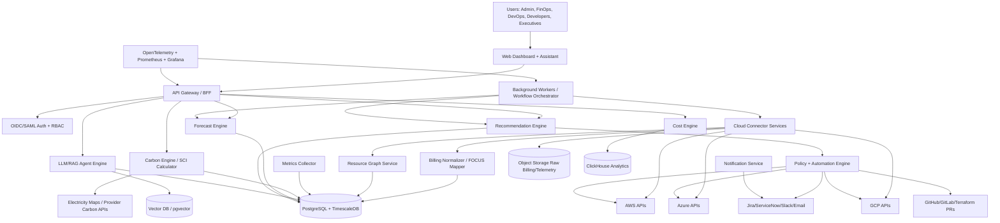

# Greencloud

Welcome to our project 

# Technical methodology used
# 12. Research Question 9 — Software Architecture

## 12.1 High-Level Architecture

## 15.5 Data Flow

1. Cloud billing and usage exports are ingested into object storage.
2. Billing is normalized into FOCUS-like cost records.
3. Resource inventory and metrics build a time-aware resource graph.
4. Carbon engine maps energy/use to carbon intensity and embodied estimates.
5. Forecast engine predicts demand and confidence intervals.
6. Recommendation engine ranks actions by savings, carbon reduction, confidence, and risk.
7. Policy engine creates ticket/PR/API execution.
8. Verification loop measures actual cost/carbon/SLO outcome.

## 15.6 API Flow

1. Client authenticates through OIDC/SAML.
2. API Gateway validates JWT, tenant, and RBAC.
3. Request routes to domain service.
4. Domain service checks object-level permissions.
5. Response includes evidence, confidence, and audit ID.

## 15.7 Cloud Resource Flow

1. Cloud account connected with read-only role.
2. Optional automation role added separately.
3. Inventory scans resources.
4. Metrics and billing attach to resources.
5. Resource graph maps workloads and owners.

## 15.8 Optimization Flow

1. Detect opportunity.
2. Estimate cost/carbon/SLO impact.
3. Attach evidence and confidence.
4. Apply policy and approval.
5. Execute via PR/ticket/API.
6. Verify and learn.

## 15.9 AI Decision Flow

1. Retrieve relevant evidence: provider docs, internal policies, telemetry, previous outcomes.
2. Generate candidate action.
3. Score with deterministic cost/carbon models.
4. Use LLM only for explanation, planning, and workflow drafting unless constrained by tools.
5. Require policy approval for execution.

---

## User views 

# 17. Research Question 14 — User Stories

## Admin

- As an Admin, I want to connect AWS/Azure/GCP accounts using least-privilege credentials so that GreenCloud AI can ingest billing and resource metadata.
- As an Admin, I want SSO, SCIM, and RBAC so that access follows enterprise identity policy.
- As an Admin, I want immutable audit logs so that all recommendations and changes can be reviewed.

## Company Owner / Executive

- As a Company Owner, I want monthly cost, savings, carbon, and SCI reports so that I can track business value and sustainability progress.
- As a Company Owner, I want unit cost and unit carbon trends so that I can understand margin and emissions per customer/product.

## Developer

- As a Developer, I want pull-request comments showing cost and carbon impact so that I can fix waste before deployment.
- As a Developer, I want explanations with evidence so that I trust recommendations.

## FinOps Engineer

- As a FinOps Engineer, I want cost allocation by team/product/environment so that I can run showback and chargeback.
- As a FinOps Engineer, I want anomaly detection and root cause so that I can respond before month-end.
- As a FinOps Engineer, I want commitment simulations so that I do not overcommit.

## DevOps Engineer

- As a DevOps Engineer, I want safe automation policies so that low-risk changes can be executed with guardrails.
- As a DevOps Engineer, I want rollback and post-change monitoring so that optimization does not break SLOs.

---

# 18. Research Question 15 — Functional Requirements

| ID | Requirement |
|---|---|
| FR-001 | Connect AWS, Azure, and Google Cloud accounts using least-privilege credentials. |
| FR-002 | Ingest billing, resource inventory, utilization metrics, recommendations, and carbon reports. |
| FR-003 | Normalize cost data using a FOCUS-compatible internal schema. |
| FR-004 | Build a resource graph with account, region, resource, Kubernetes workload, tags, and owners. |
| FR-005 | Detect idle resources across compute, storage, databases, load balancers, NAT gateways, and IPs. |
| FR-006 | Generate rightsizing recommendations for VMs, containers, storage, databases, and serverless where telemetry supports it. |
| FR-007 | Generate scheduling/parking recommendations for non-production and flexible workloads. |
| FR-008 | Simulate Reserved Instance/Savings Plan/CUD coverage and utilization scenarios. |
| FR-009 | Detect cost anomalies and carbon anomalies. |
| FR-010 | Forecast cost, demand, and resource utilization with confidence intervals. |
| FR-011 | Calculate operational carbon, embodied carbon estimates, and SCI per functional unit. |
| FR-012 | Integrate Electricity Maps or similar carbon-intensity provider. |
| FR-013 | Rank recommendations by cost savings, carbon savings, risk, confidence, and effort. |
| FR-014 | Provide evidence and source traceability for recommendations. |
| FR-015 | Support approval workflows for high-risk actions. |
| FR-016 | Create Jira/ServiceNow tickets and GitHub/GitLab pull requests. |
| FR-017 | Execute approved low-risk changes through cloud APIs where configured. |
| FR-018 | Monitor post-change SLO/cost/carbon outcomes and rollback when required. |
| FR-019 | Provide dashboards for cost, carbon, SCI, utilization, anomalies, budgets, and recommendation status. |
| FR-020 | Provide RAG assistant for FinOps/GreenOps questions with citations. |
| FR-021 | Export reports as PDF/CSV/JSON. |
| FR-022 | Maintain immutable audit logs. |

---

# 19. Research Question 16 — Non-Functional Requirements

| Category | Requirement |
|---|---|
| Performance | Dashboard queries for common aggregates should return within 2 seconds for cached data; large analytical queries should be asynchronous. This is a product target, not a published benchmark. |
| Scalability | Architecture must support millions of resources and billions of billing/metric rows by separating OLTP, OLAP, and object storage. |
| Reliability | Ingestion jobs must be idempotent and resumable; raw billing files must be immutable. |
| Availability | SaaS control plane target should be at least 99.9% after production maturity. This is a design target, not evidence from sources. |
| Security | Least privilege, tenant isolation, encryption in transit/at rest, KMS/Vault secrets, RBAC, audit logs. |
| Maintainability | Domain services, typed schemas, contract tests for provider adapters, IaC-managed infrastructure. |
| Accessibility | WCAG 2.1 AA target for dashboards and reports. |
| Data governance | Retention controls, PII minimization, data residency options, customer-managed keys for enterprise. |
| Explainability | Every recommendation must include input metrics, assumptions, confidence, evidence links, and rollback plan. |
| Observability | OpenTelemetry traces, Prometheus metrics, centralized logs, SLOs for ingestion latency and recommendation freshness. |

---

# 20. Research Question 17 — Complete Technology Stack

## 20.1 Recommended Stack

| Layer | Recommended technology | Why chosen | Alternatives | Evidence / Notes |
|---|---|---|---|---|
| Frontend | React + TypeScript + Next.js | Mature dashboard ecosystem, strong typing, SSR for reports. | Vue/Nuxt, SvelteKit. | Engineering choice; no external claim. |
| API | Go or Java/Kotlin for core APIs; Python FastAPI for AI services | Go efficient for connectors/workers; Python strong ML ecosystem. | Node.js, Rust. | Engineering choice. |
| Workflow | Temporal | Durable workflows for syncs and automation. | Airflow, Argo Workflows, Step Functions. | Engineering choice. |
| OLTP DB | PostgreSQL + TimescaleDB | Strong relational model + time-series extension. | MySQL, CockroachDB. | Engineering choice. |
| OLAP | ClickHouse | Efficient analytical queries on billing line items. | BigQuery, Snowflake, DuckDB. | Engineering choice. |
| Raw data | S3/GCS/Azure Blob-compatible object storage | Immutable raw billing and reports. | MinIO, HDFS. | Engineering choice. |
| Queue/stream | Kafka/Redpanda | Event streaming for ingestion and anomaly events. | NATS, RabbitMQ, Pub/Sub/SQS. | Engineering choice. |
| Cache | Redis | Rate limits, job state, query cache. | Memcached, KeyDB. | Engineering choice. |
| Vector store | pgvector initially; Weaviate/Qdrant later | Simpler ops in PostgreSQL; upgrade path for scale. | Pinecone, OpenSearch vector. | Engineering choice. |
| ML/forecasting | scikit-learn, StatsForecast, Prophet, PyTorch | Baselines + deep learning; uncertainty support. | TensorFlow, GluonTS. | Supported by forecasting literature [2](https://link.springer.com/article/10.1186/s13677-019-0128-9), [10](https://link.springer.com/article/10.1007/s10586-024-04933-2). |
| Carbon data | Electricity Maps + provider carbon APIs + CCF method | Hourly/forecast carbon intensity and multi-cloud estimates. | WattTime, Climatiq. | Electricity Maps docs [1](https://portal.electricitymaps.com/docs), CCF docs [2](https://www.cloudcarbonfootprint.org/docs/methodology/). |
| Kubernetes cost | OpenCost integration | OSS cost allocation standard for K8s. | Kubecost commercial, cloud provider allocation. | OpenCost docs [1](https://opencost.io/docs/). |
| Energy telemetry | Kepler | K8s power metrics via eBPF/Prometheus. | RAPL custom exporters, cloud provider estimates. | Kepler package docs [2](https://pkg.go.dev/github.com/sustainable-computing-io/kepler). |
| Policy | OPA/Rego + Cloud Custodian-inspired YAML | Policy-as-code and governance automation. | Cedar, Kyverno, Sentinel. | Cloud Custodian docs [2](https://cloudcustodian.io/docs/overview.html). |
| Auth | Keycloak/Auth0/Okta OIDC/SAML | Enterprise SSO. | AWS Cognito, Azure AD B2C. | Engineering choice. |
| Observability | OpenTelemetry + Prometheus + Grafana + Loki/Tempo | Cloud-native observability. | Datadog, New Relic. | CNCF ecosystem. |
| IaC | Terraform/OpenTofu + Helm | Cloud provider automation and PR remediation. | Pulumi, Crossplane. | Engineering choice. |
