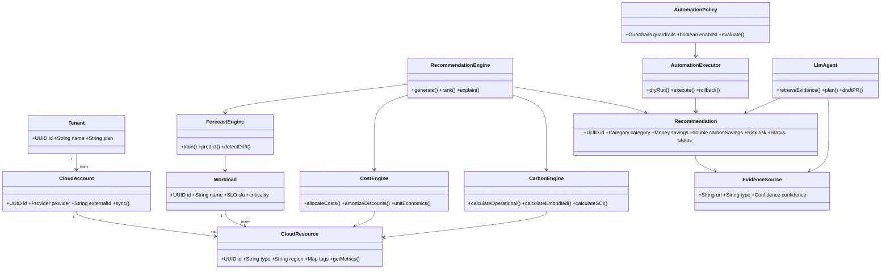
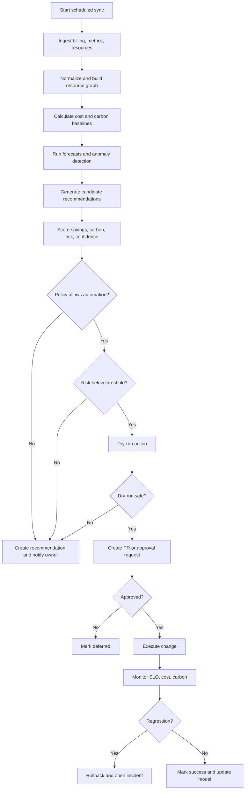
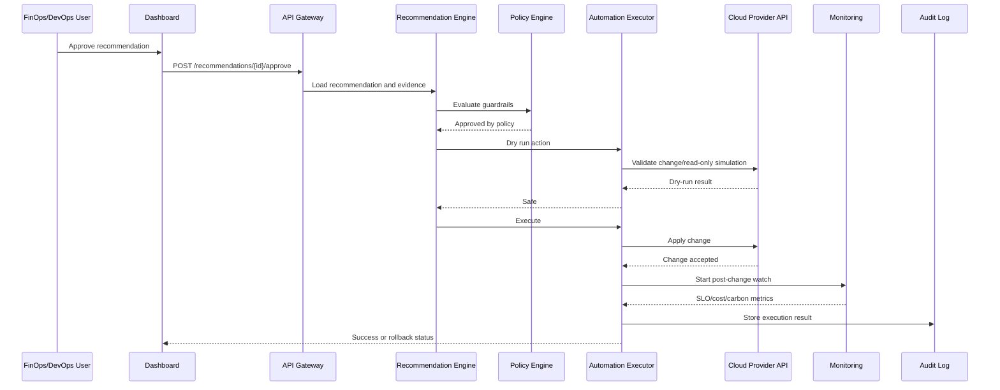
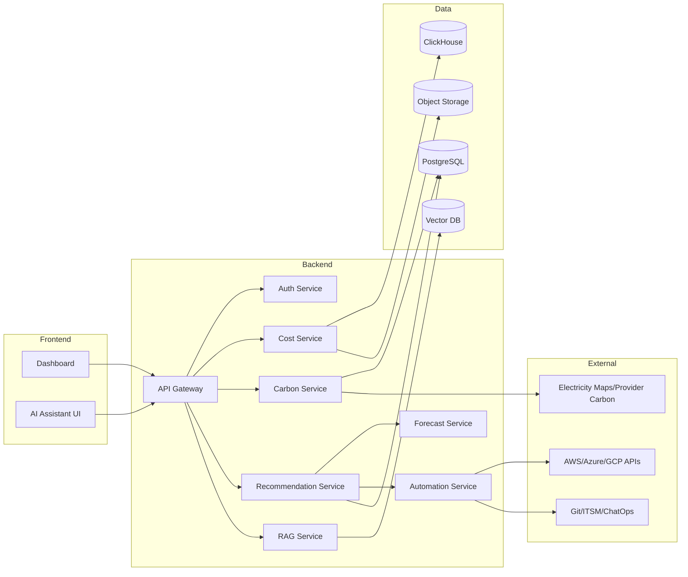

# Software Domain Class Diagram & Object Model

## Class Diagram

**Explanation:** This class diagram separates domain entities from decision engines. Recommendations are not just text; they carry savings, carbon impact, risk, status, and evidence.

## 14.3 Activity Diagram — Optimization Workflow

**Explanation:** The workflow is intentionally human-in-the-loop for risk. Even allowed automation must pass policy, risk, dry-run, approval, and post-change monitoring.

## 14.4 Sequence Diagram — Recommendation Execution

**Explanation:** The sequence emphasizes auditability and rollback monitoring.

## 14.5 Component Diagram

**Explanation:** Components are isolated so carbon, cost, forecast, recommendations, and automation can evolve independently.