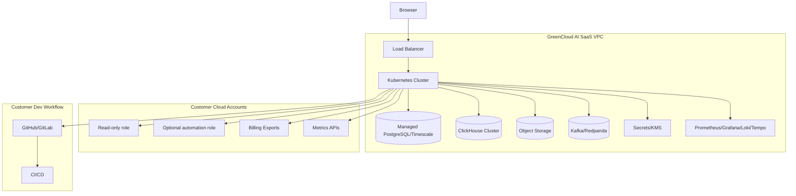
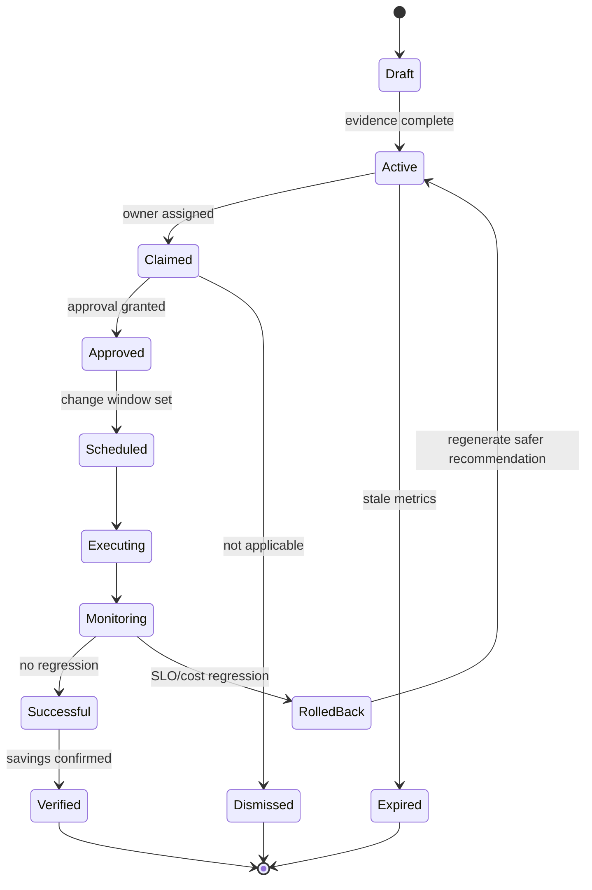
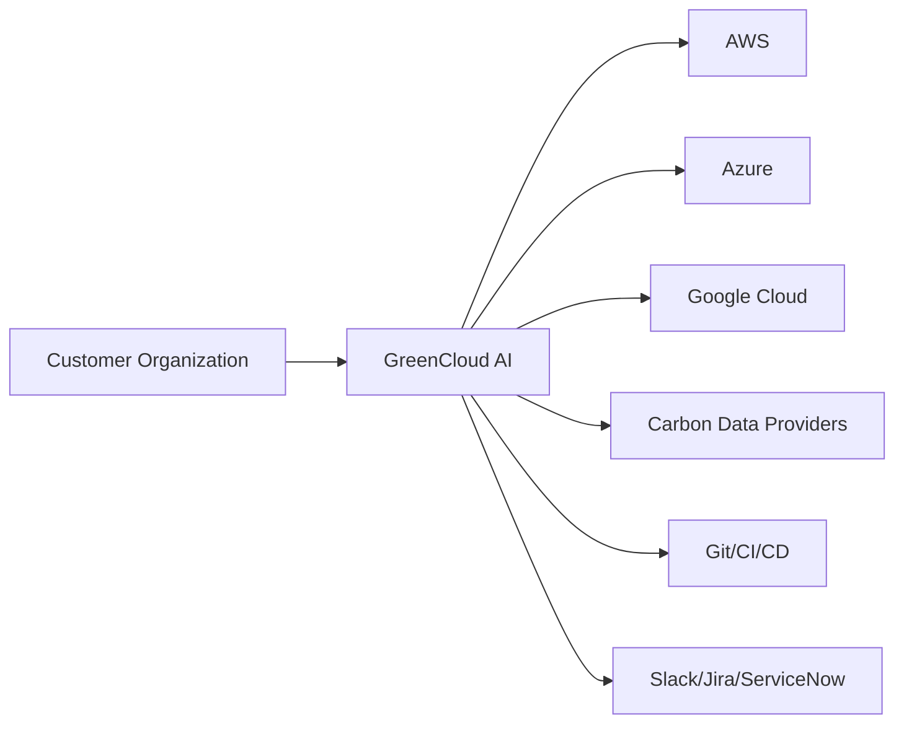
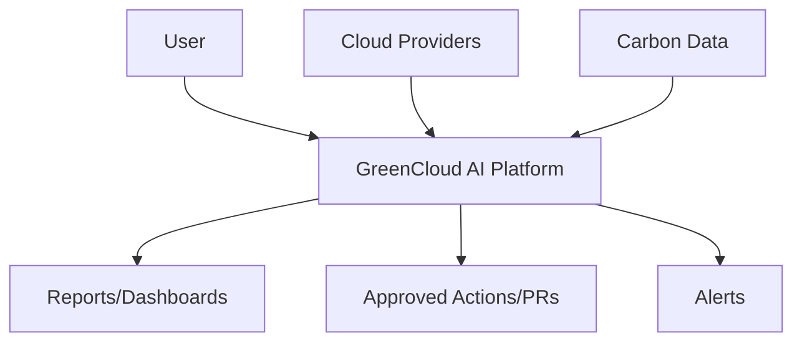
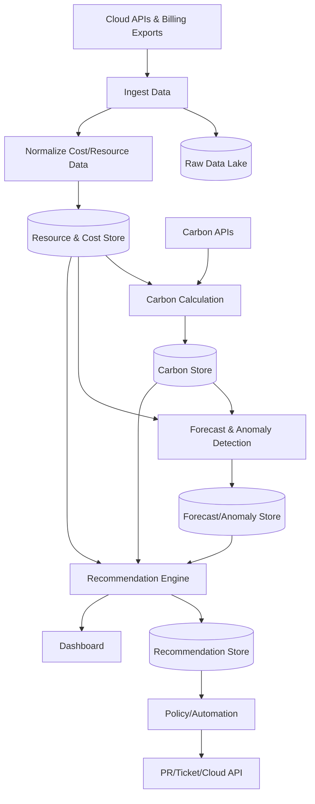
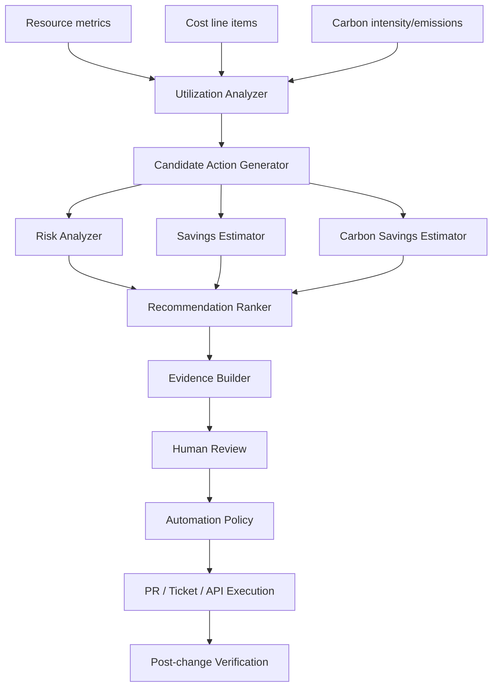

# Architecture & Deployment Topology

## 1. Deployment Diagram

**Explanation:** Deployment is SaaS-first but can support private deployment for regulated customers.

---

## 2. State Diagram — Recommendation Lifecycle

**Explanation:** Recommendations are first-class lifecycle objects, not one-time alerts.

---

## 3. System Design & Data Flow Diagrams (DFDs)

### 3.1 Context Diagram

### 3.2 DFD Level 0

### 3.3 DFD Level 1

### 3.4 DFD Level 2 — Optimization Flow

---

## 4. Operational Execution & Data Flows

### 4.1 Data Ingestion & Processing Flow
1. Cloud billing and usage exports are ingested into object storage.
2. Billing is normalized into FOCUS-like cost records.
3. Resource inventory and metrics build a time-aware resource graph.
4. Carbon engine maps energy/use to carbon intensity and embodied estimates.
5. Forecast engine predicts demand and confidence intervals.
6. Recommendation engine ranks actions by savings, carbon reduction, confidence, and risk.
7. Policy engine creates ticket/PR/API execution.
8. Verification loop measures actual cost/carbon/SLO outcome.

### 4.2 API Authentication & Routing Flow
1. Client authenticates through OIDC/SAML.
2. API Gateway validates JWT, tenant, and RBAC.
3. Request routes to domain service.
4. Domain service checks object-level permissions.
5. Response includes evidence, confidence, and audit ID.

### 4.3 Cloud Resource Scan Flow
1. Cloud account connected with read-only role.
2. Optional automation role added separately.
3. Inventory scans resources.
4. Metrics and billing attach to resources.
5. Resource graph maps workloads and owners.

### 4.4 Optimization Execution Flow
1. Detect opportunity.
2. Estimate cost/carbon/SLO impact.
3. Attach evidence and confidence.
4. Apply policy and approval.
5. Execute via PR/ticket/API.
6. Verify and learn.

### 4.5 AI Decision Pipeline Flow

1. Retrieve relevant evidence: provider docs, internal policies, telemetry, previous outcomes.
2. Generate candidate action.
3. Score with deterministic cost/carbon models.
4. Use LLM only for explanation, planning, and workflow drafting unless constrained by tools.
5. Require policy approval for execution.
