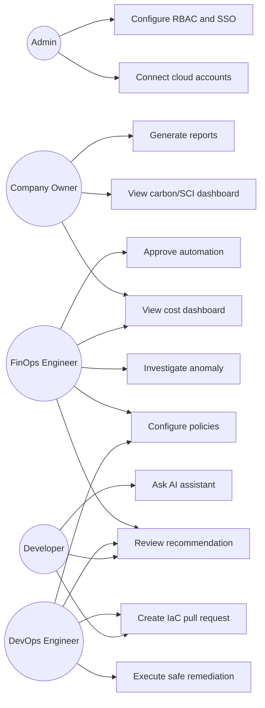

# System Requirements & Use Case Specification

## 1. Use Case Diagram

**Explanation:** This diagram shows GreenCloud AI as a collaboration platform. Admins connect accounts and configure access. FinOps owns visibility and governance. DevOps executes controlled changes. Developers receive recommendation context and PRs. Company owners consume reports.

---

## 2. User Stories

### 2.1 Admin
- As an Admin, I want to connect AWS/Azure/GCP accounts using least-privilege credentials so that GreenCloud AI can ingest billing and resource metadata.
- As an Admin, I want SSO, SCIM, and RBAC so that access follows enterprise identity policy.
- As an Admin, I want immutable audit logs so that all recommendations and changes can be reviewed.

### 2.2 Company Owner / Executive
- As a Company Owner, I want monthly cost, savings, carbon, and SCI reports so that I can track business value and sustainability progress.
- As a Company Owner, I want unit cost and unit carbon trends so that I can understand margin and emissions per customer/product.

### 2.3 Developer
- As a Developer, I want pull-request comments showing cost and carbon impact so that I can fix waste before deployment.
- As a Developer, I want explanations with evidence so that I trust recommendations.

### 2.4 FinOps Engineer
- As a FinOps Engineer, I want cost allocation by team/product/environment so that I can run showback and chargeback.
- As a FinOps Engineer, I want anomaly detection and root cause so that I can respond before month-end.
- As a FinOps Engineer, I want commitment simulations so that I do not overcommit.

### 2.5 DevOps Engineer
- As a DevOps Engineer, I want safe automation policies so that low-risk changes can be executed with guardrails.
- As a DevOps Engineer, I want rollback and post-change monitoring so that optimization does not break SLOs.

---

## 3. Functional Requirements

| ID | Requirement |
|---|---|
| FR-001 | Connect AWS, Azure, and Google Cloud accounts using least-privilege credentials. |
| FR-002 | Ingest billing, resource inventory, utilization metrics, recommendations, and carbon reports. |
| FR-003 | Normalize cost data using a FOCUS-compatible internal schema. |
| FR-004 | Build a resource graph with account, region, resource, Kubernetes workload, tags, and owners. |
| FR-005 | Detect idle resources across compute, storage, databases, load balancers, NAT gateways, and IPs. |
| FR-006 | Generate rightsizing recommendations for VMs, containers, storage, databases, and serverless where telemetry supports it. |
| FR-007 | Generate scheduling/parking recommendations for non-production and flexible workloads. |
| FR-008 | Simulate Reserved Instance/Savings Plan/CUD coverage and utilization scenarios. |
| FR-009 | Detect cost anomalies and carbon anomalies. |
| FR-010 | Forecast cost, demand, and resource utilization with confidence intervals. |
| FR-011 | Calculate operational carbon, embodied carbon estimates, and SCI per functional unit. |
| FR-012 | Integrate Electricity Maps or similar carbon-intensity provider. |
| FR-013 | Rank recommendations by cost savings, carbon savings, risk, confidence, and effort. |
| FR-014 | Provide evidence and source traceability for recommendations. |
| FR-015 | Support approval workflows for high-risk actions. |
| FR-016 | Create Jira/ServiceNow tickets and GitHub/GitLab pull requests. |
| FR-017 | Execute approved low-risk changes through cloud APIs where configured. |
| FR-018 | Monitor post-change SLO/cost/carbon outcomes and rollback when required. |
| FR-019 | Provide dashboards for cost, carbon, SCI, utilization, anomalies, budgets, and recommendation status. |
| FR-020 | Provide RAG assistant for FinOps/GreenOps questions with citations. |
| FR-021 | Export reports as PDF/CSV/JSON. |
| FR-022 | Maintain immutable audit logs. |

---

## 4. Non-Functional Requirements

| Category | Requirement |
|---|---|
| Performance | Dashboard queries for common aggregates should return within 2 seconds for cached data; large analytical queries should be asynchronous. |
| Scalability | Architecture must support millions of resources and billions of billing/metric rows by separating OLTP, OLAP, and object storage. |
| Reliability | Ingestion jobs must be idempotent and resumable; raw billing files must be immutable. |
| Availability | SaaS control plane target should be at least 99.9% after production maturity. |
| Security | Least privilege, tenant isolation, encryption in transit/at rest, KMS/Vault secrets, RBAC, audit logs. |
| Maintainability | Domain services, typed schemas, contract tests for provider adapters, IaC-managed infrastructure. |
| Accessibility | WCAG 2.1 AA target for dashboards and reports. |
| Data governance | Retention controls, PII minimization, data residency options, customer-managed keys for enterprise. |
| Explainability | Every recommendation must include input metrics, assumptions, confidence, evidence links, and rollback plan. |
| Observability | OpenTelemetry traces, Prometheus metrics, centralized logs, SLOs for ingestion latency and recommendation freshness. |

