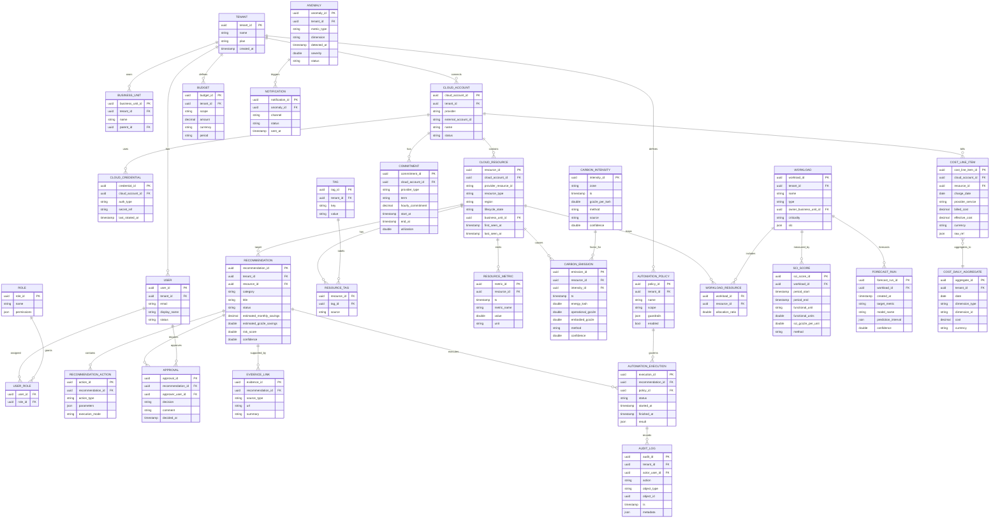

## 13.2 ER Diagram

```mermaid
erDiagram
  TENANT ||--o{ USER : has
  TENANT ||--o{ BUSINESS_UNIT : owns
  TENANT ||--o{ CLOUD_ACCOUNT : connects
  TENANT ||--o{ BUDGET : defines
  TENANT ||--o{ AUTOMATION_POLICY : defines
  USER ||--o{ USER_ROLE : assigned
  ROLE ||--o{ USER_ROLE : grants
  CLOUD_ACCOUNT ||--o{ CLOUD_CREDENTIAL : uses
  CLOUD_ACCOUNT ||--o{ CLOUD_RESOURCE : contains
  CLOUD_ACCOUNT ||--o{ COST_LINE_ITEM : bills
  CLOUD_ACCOUNT ||--o{ COMMITMENT : has
  CLOUD_RESOURCE ||--o{ RESOURCE_TAG : has
  TAG ||--o{ RESOURCE_TAG : labels
  CLOUD_RESOURCE ||--o{ RESOURCE_METRIC : emits
  CLOUD_RESOURCE ||--o{ CARBON_EMISSION : causes
  CLOUD_RESOURCE ||--o{ RECOMMENDATION : target
  CLOUD_RESOURCE ||--o{ WORKLOAD_RESOURCE : maps
  WORKLOAD ||--o{ WORKLOAD_RESOURCE : includes
  WORKLOAD ||--o{ SCI_SCORE : measured_by
  WORKLOAD ||--o{ FORECAST_RUN : forecasts
  COST_LINE_ITEM }o--|| COST_DAILY_AGGREGATE : aggregates_to
  CARBON_INTENSITY ||--o{ CARBON_EMISSION : factor_for
  RECOMMENDATION ||--o{ RECOMMENDATION_ACTION : contains
  RECOMMENDATION ||--o{ APPROVAL : requires
  RECOMMENDATION ||--o{ EVIDENCE_LINK : supported_by
  RECOMMENDATION ||--o{ AUTOMATION_EXECUTION : executes
  AUTOMATION_POLICY ||--o{ AUTOMATION_EXECUTION : governs
  AUTOMATION_EXECUTION ||--o{ AUDIT_LOG : records
  ANOMALY ||--o{ NOTIFICATION : triggers
  USER ||--o{ APPROVAL : approves

  TENANT {
    uuid tenant_id PK
    string name
    string plan
    timestamp created_at
  }
  USER {
    uuid user_id PK
    uuid tenant_id FK
    string email
    string display_name
    string status
  }
  ROLE {
    uuid role_id PK
    string name
    json permissions
  }
  USER_ROLE {
    uuid user_id FK
    uuid role_id FK
  }
  BUSINESS_UNIT {
    uuid business_unit_id PK
    uuid tenant_id FK
    string name
    uuid parent_id FK
  }
  CLOUD_ACCOUNT {
    uuid cloud_account_id PK
    uuid tenant_id FK
    string provider
    string external_account_id
    string name
    string status
  }
  CLOUD_CREDENTIAL {
    uuid credential_id PK
    uuid cloud_account_id FK
    string auth_type
    string secret_ref
    timestamp last_rotated_at
  }
  CLOUD_RESOURCE {
    uuid resource_id PK
    uuid cloud_account_id FK
    string provider_resource_id
    string resource_type
    string region
    string lifecycle_state
    uuid business_unit_id FK
    timestamp first_seen_at
    timestamp last_seen_at
  }
  TAG {
    uuid tag_id PK
    uuid tenant_id FK
    string key
    string value
  }
  RESOURCE_TAG {
    uuid resource_id FK
    uuid tag_id FK
    string source
  }
  RESOURCE_METRIC {
    uuid metric_id PK
    uuid resource_id FK
    timestamp ts
    string metric_name
    double value
    string unit
  }
  COST_LINE_ITEM {
    uuid cost_line_item_id PK
    uuid cloud_account_id FK
    uuid resource_id FK
    date charge_date
    string provider_service
    decimal billed_cost
    decimal effective_cost
    string currency
    json raw_ref
  }
  COST_DAILY_AGGREGATE {
    uuid aggregate_id PK
    uuid tenant_id FK
    date date
    string dimension_type
    string dimension_id
    decimal cost
    string currency
  }
  CARBON_INTENSITY {
    uuid intensity_id PK
    string zone
    timestamp ts
    double gco2e_per_kwh
    string method
    string source
    double confidence
  }
  CARBON_EMISSION {
    uuid emission_id PK
    uuid resource_id FK
    uuid intensity_id FK
    timestamp ts
    double energy_kwh
    double operational_gco2e
    double embodied_gco2e
    string method
    double confidence
  }
  WORKLOAD {
    uuid workload_id PK
    uuid tenant_id FK
    string name
    string type
    uuid owner_business_unit_id FK
    string criticality
    json slo
  }
  WORKLOAD_RESOURCE {
    uuid workload_id FK
    uuid resource_id FK
    double allocation_ratio
  }
  SCI_SCORE {
    uuid sci_score_id PK
    uuid workload_id FK
    timestamp period_start
    timestamp period_end
    string functional_unit
    double functional_units
    double sci_gco2e_per_unit
    string method
  }
  FORECAST_RUN {
    uuid forecast_run_id PK
    uuid workload_id FK
    timestamp created_at
    string target_metric
    string model_name
    json prediction_interval
    double confidence
  }
  RECOMMENDATION {
    uuid recommendation_id PK
    uuid tenant_id FK
    uuid resource_id FK
    string category
    string title
    string status
    decimal estimated_monthly_savings
    double estimated_gco2e_savings
    double risk_score
    double confidence
  }
  RECOMMENDATION_ACTION {
    uuid action_id PK
    uuid recommendation_id FK
    string action_type
    json parameters
    string execution_mode
  }
  AUTOMATION_POLICY {
    uuid policy_id PK
    uuid tenant_id FK
    string name
    string scope
    json guardrails
    bool enabled
  }
  APPROVAL {
    uuid approval_id PK
    uuid recommendation_id FK
    uuid approver_user_id FK
    string decision
    string comment
    timestamp decided_at
  }
  AUTOMATION_EXECUTION {
    uuid execution_id PK
    uuid recommendation_id FK
    uuid policy_id FK
    string status
    timestamp started_at
    timestamp finished_at
    json result
  }
  ANOMALY {
    uuid anomaly_id PK
    uuid tenant_id FK
    string metric_type
    string dimension
    timestamp detected_at
    double severity
    string status
  }
  NOTIFICATION {
    uuid notification_id PK
    uuid anomaly_id FK
    string channel
    string status
    timestamp sent_at
  }
  EVIDENCE_LINK {
    uuid evidence_id PK
    uuid recommendation_id FK
    string source_type
    string url
    string summary
  }
  AUDIT_LOG {
    uuid audit_id PK
    uuid tenant_id FK
    uuid actor_user_id FK
    string action
    string object_type
    uuid object_id
    timestamp ts
    json metadata
  }
  COMMITMENT {
    uuid commitment_id PK
    uuid cloud_account_id FK
    string provider_type
    string term
    decimal hourly_commitment
    timestamp start_at
    timestamp end_at
    double utilization
  }
  BUDGET {
    uuid budget_id PK
    uuid tenant_id FK
    string scope
    decimal amount
    string currency
    string period
  }
```