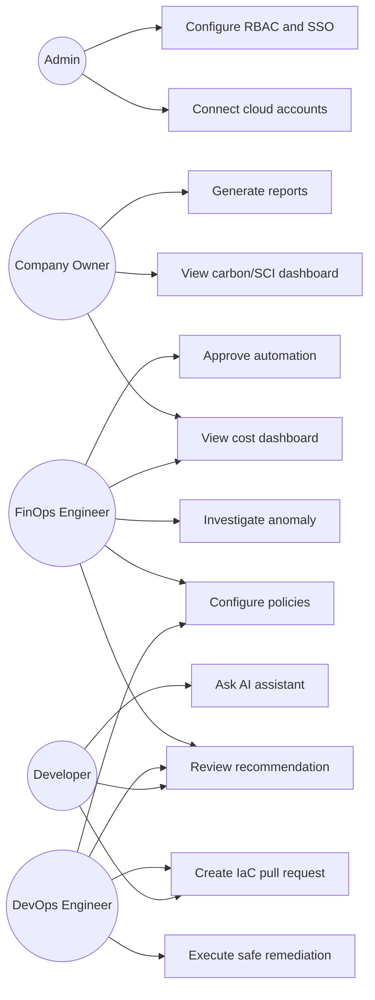

## 14.1 Use Case Diagram

**Explanation:** This diagram shows GreenCloud AI as a collaboration platform. Admins connect accounts and configure access. FinOps owns visibility and governance. DevOps executes controlled changes. Developers receive recommendation context and PRs. Company owners consume reports.