# GreenCloud AI — Professional Research & System Design Report

**Project:** GreenCloud AI  
**Purpose:** An AI platform that helps organizations reduce cloud cost and carbon emissions across AWS, Azure, and Google Cloud by analyzing resources, forecasting demand, and recommending or automating optimizations.  
**Prepared by:** Arena.ai agentic software research assistant  
**Date:** 2026-07-31  
**Important limitation:** This is a targeted systematic-style research report, not a legally exhaustive systematic literature review. I prioritized peer-reviewed work, official documentation, and active open-source projects. Some commercial competitor internals and exact pricing are not public. Where public evidence was not found, the report says so explicitly.

---

## Evidence and Confidence Policy

- **High confidence:** peer-reviewed papers, official vendor documentation, official project docs/GitHub, or standards documents.
- **Medium confidence:** reputable engineering blogs, official marketplace listings, public case studies, or GitHub metadata.
- **Low confidence:** community discussions, Reddit, Hacker News, Stack Overflow, or third-party pricing pages. These are used only for pain-point discovery, not as technical proof.
- **No invented facts:** if a feature, benchmark, price, dataset, or competitor internal architecture was not found in public evidence, it is marked **Evidence not found** or **Not enough published evidence was found**.

---

# Table of Contents

1. [Executive Summary](#1-executive-summary)
2. [Research Method](#2-research-method)
3. [Introduction](#3-introduction)
4. [Research Question 1 — Problem Solved](#4-research-question-1--what-problem-does-greencloud-ai-solve)
5. [Research Question 2 — Existing Cloud Cost Reduction Methods](#5-research-question-2--how-do-companies-currently-reduce-cloud-costs)
6. [Research Question 3 — Cloud Carbon Footprint Measurement](#6-research-question-3--how-is-cloud-carbon-footprint-measured)
7. [Research Question 4 — Useful AI Techniques](#7-research-question-4--what-ai-techniques-are-useful)
8. [Research Question 5 — Competitor Analysis](#8-research-question-5--competitor-analysis)
9. [Research Question 6 — Open-Source Projects](#9-research-question-6--open-source-projects)
10. [Research Question 7 — Academic Literature Review](#10-research-question-7--academic-literature-review)
11. [Research Question 8 — User Pain Points](#11-research-question-8--user-pain-points)
12. [Research Question 9 — Software Architecture](#12-research-question-9--software-architecture)
13. [Research Question 10 — Database Design and ER Diagram](#13-research-question-10--database-design-and-er-diagram)
14. [Research Question 11 — UML Diagrams](#14-research-question-11--uml-diagrams)
15. [Research Question 12 — System Design and DFDs](#15-research-question-12--system-design-and-dfds)
16. [Research Question 13 — API Design](#16-research-question-13--api-design)
17. [Research Question 14 — User Stories](#17-research-question-14--user-stories)
18. [Research Question 15 — Functional Requirements](#18-research-question-15--functional-requirements)
19. [Research Question 16 — Non-Functional Requirements](#19-research-question-16--non-functional-requirements)
20. [Research Question 17 — Complete Technology Stack](#20-research-question-17--complete-technology-stack)
21. [Research Question 18 — Risks](#21-research-question-18--risks)
22. [Research Question 19 — Innovation Opportunities](#22-research-question-19--innovative-features-that-are-justified-by-evidence)
23. [Research Findings](#23-research-findings)
24. [Research Gaps](#24-research-gaps)
25. [Future Work](#25-future-work)
26. [References](#26-references)

---

# 1. Executive Summary

GreenCloud AI addresses two related but not identical problems: **cloud financial waste** and **cloud-related carbon emissions**. Evidence from cloud-provider documentation and academic systems research shows that waste arises from idle resources, over-provisioning, poor rightsizing, inaccurate resource requests, missing cost attribution, delayed cost feedback, underused discounts, and lack of automation. AWS officially groups cost optimization actions into Savings Plans, reservations, stopping/deleting idle resources, scale-in, rightsizing, upgrades, and Graviton migration [2](https://docs.aws.amazon.com/cost-management/latest/userguide/coh-optimization-strategies.html). Azure Advisor’s Cost Optimization workbook similarly covers rate optimization, idle resources, reservations, Savings Plans, Hybrid Benefit, compute, storage, and networking [5](https://learn.microsoft.com/en-us/azure/advisor/advisor-workbook-cost-optimization). Google’s Recommender and CUD recommendation systems analyze historical and recent billing/resource metrics to generate recommendations [1](https://docs.cloud.google.com/docs/cuds-recommender), [3](https://docs.cloud.google.com/recommender/docs/key-concepts).

For carbon measurement, the most credible framework is the Green Software Foundation’s **Software Carbon Intensity (SCI)** specification: `SCI = (Operational emissions + Embodied emissions) per functional unit`, where operational emissions are energy multiplied by region-specific carbon intensity, and embodied emissions allocate hardware manufacturing/disposal emissions to software use [5](https://sci.greensoftware.foundation/). Google Cloud’s Carbon Footprint methodology uses GHGP location-based and market-based reporting, machine-level energy allocation, hourly emission factors for location-based emissions, and includes Scope 1, 2, and selected Scope 3 categories; Google explicitly notes that customer-specific reports are not third-party assured [1](https://docs.cloud.google.com/carbon-footprint/docs/methodology). Cloud Carbon Footprint offers a multi-cloud open-source estimation method but states that it uses point estimates without confidence intervals and is not a replacement for provider data [2](https://www.cloudcarbonfootprint.org/docs/methodology/).

Competitor tools already cover pieces of the problem: CloudHealth, CloudZero, Flexera, IBM Turbonomic, Harness, Kubecost/OpenCost, CAST AI, and native provider advisors. The main gaps found in public evidence are: **multi-cloud cost + carbon in one optimization loop, workload-level SCI, confidence-scored recommendations with safety evidence, carbon-aware automation, IaC pull-request remediation, transparent carbon-data quality scoring, and AI workload unit economics with emissions**. Public evidence for full competitor support of these combined capabilities was not found.

Recommended product strategy: build GreenCloud AI as a **FinOps + GreenOps intelligence and automation platform** with a trusted data layer, normalized cost model, resource graph, time-series telemetry, carbon engine, forecasting engine, recommendation engine, RAG-backed evidence assistant, human-in-the-loop automation, and integration with Terraform/GitOps for safe remediation.

---

# 2. Research Method

## 2.1 Search Priority

The research followed the requested priority order:

1. **Peer-reviewed papers** from ACM, IEEE, Springer, Nature/Scientific Reports, ScienceDirect, and arXiv only when peer-reviewed work was unavailable or where the paper is widely cited/preprint-based.
2. **Official documentation** from AWS, Microsoft Azure, Google Cloud, Green Software Foundation, FinOps Foundation, Electricity Maps, CNCF/OpenCost, Cloud Custodian, Harness, IBM, and Flexera.
3. **Official GitHub repositories** with active maintenance signals. GitHub API checks on 2026-07-31 showed recent updates for OpenCost, Cloud Custodian, CodeCarbon, Kepler, Infracost, KEDA, Kubernetes Autoscaler, kube-green, Green Metrics Tool, Carbon Aware SDK, and Cloud Carbon Footprint.
4. **Engineering blogs** from reputable companies/projects where official or peer-reviewed evidence was not enough.
5. **Community discussions** from Hacker News, Reddit, Stack Overflow, and GitHub issues used only for user pain points.

## 2.2 Inclusion Criteria

- Direct relevance to cost optimization, cloud resource management, Kubernetes optimization, forecasting, energy-efficient computing, cloud carbon accounting, green software, FinOps, or competitor products.
- Publicly accessible metadata and enough source detail to identify author/year/source type.
- For open-source analysis: repository not archived and recent update/maintenance evidence.

## 2.3 Exclusion Criteria

- Unsourced marketing claims without supporting documentation.
- Third-party pricing estimates unless no official pricing was available; such estimates are marked low/medium confidence.
- Community claims as technical proof.
- Any statistics not present in trusted evidence.

## 2.4 Limitations of This Review

- Paid databases such as IEEE Xplore and ACM full text may have access restrictions; some summaries rely on abstracts and metadata.
- Commercial competitors do not publish all architecture, model, or pricing details.
- Cloud pricing changes frequently.
- Carbon accounting methodologies are evolving and differ across providers.
- Community pain-point frequency is qualitative, not a statistically representative survey.

---

# 3. Introduction

GreenCloud AI is proposed as a platform combining **FinOps** and **GreenOps**. FinOps is an operating model for maximizing technology value; the FinOps Foundation framework includes domains such as Understand Usage & Cost, Quantify Business Value, Optimize Usage & Cost, and Manage the FinOps Practice, with capabilities such as data ingestion, allocation, forecasting, anomaly management, usage optimization, rate optimization, sustainability, and automation [1](https://www.finops.org/framework/). FOCUS, the FinOps Open Cost and Usage Specification, normalizes billing datasets across AI, cloud, SaaS, data center, and other technology vendors [1](https://focus.finops.org/).

GreenOps extends this with carbon measurement and reduction. The SCI standard says software emissions come from the energy consumed by hardware and the emissions associated with manufacturing hardware, and it recommends energy efficiency, hardware efficiency, and carbon-aware actions [5](https://sci.greensoftware.foundation/).

GreenCloud AI should therefore be designed not merely as a dashboard, but as a **decision system** that answers:

- What are we spending?
- Who owns it?
- Which resources are idle, oversized, risky, or carbon-intensive?
- What will demand look like next week/month?
- Which actions reduce cost without violating SLOs?
- Which actions reduce emissions, and how confident are we?
- Can the platform safely create a pull request, ticket, schedule, or automated change?

---

# 4. Research Question 1 — What Problem Does GreenCloud AI Solve?

## 4.1 Problem Statement

GreenCloud AI solves the problem of **continuous cloud waste and emissions caused by dynamic, complex, shared, and poorly attributed cloud infrastructure**.

### Evidence-backed causes of cloud waste

| Cause | Evidence | Source Type | Year | Authors | Limitation | Confidence |
|---|---|---:|---:|---|---|---|
| Idle or unused resources continue to incur cost. AWS Cost Optimization Hub explicitly recommends Stop/Delete/Scale-in for idle or unused resources and maps these actions to EC2, RDS, EBS, ECS, and other services. | AWS Cost Optimization Hub [2](https://docs.aws.amazon.com/cost-management/latest/userguide/coh-optimization-strategies.html) | Official docs | 2026 page | AWS | Vendor-specific to AWS; thresholds not fully exposed. | High |
| Over-provisioning occurs because users specify resource limits conservatively to avoid throttling/OOM. Google’s Autopilot paper states human operators err on the side of larger limits and that at scale this causes aggregate resource waste. | Rządca et al. [10](https://www.semanticscholar.org/paper/Autopilot:-workload-autoscaling-at-Google-Rz%C4%85dca-Findeisen/f1fe5a8700e7c915a7e58dd69bd0e397f6d0a316) | Peer-reviewed | 2020 | Rządca, Findeisen, Świderski, Zych, Broniek, Kuśmierek, Nowak, Strack, Witusowski, Hand, Wilkes | Google internal fleet; not all workloads. | High |
| Kubernetes can hide cost allocation because costs are billed at nodes while workloads live at pods/namespaces. OpenCost is explicitly built for Kubernetes cost monitoring, showback, and chargeback. | OpenCost docs [1](https://opencost.io/docs/) | Official OSS docs | 2026 page | OpenCost/CNCF community | Kubernetes-focused. | High |
| Complex pricing models create rate-optimization challenges. AWS, Azure, and GCP all have commitment-based discounts and recommend analysis before purchasing commitments. | AWS [5](https://aws.amazon.com/aws-cost-management/cost-optimization/), Azure [5](https://learn.microsoft.com/en-us/azure/advisor/advisor-workbook-cost-optimization), GCP CUD docs [1](https://docs.cloud.google.com/docs/cuds-recommender) | Official docs | 2026 pages | AWS, Microsoft, Google | Provider-specific and subject to pricing changes. | High |
| Carbon emissions depend on energy consumption, region-specific grid carbon intensity, and embodied hardware. | GSF SCI spec [5](https://sci.greensoftware.foundation/) | Standard | 2024/2026 page | Green Software Foundation | Requires granular data often unavailable in public cloud. | High |
| Carbon reports vary in method and assurance status. Google Cloud says its customer-specific Carbon Footprint reports are not third-party verified or assured. | Google Cloud Carbon Footprint [1](https://docs.cloud.google.com/carbon-footprint/docs/methodology) | Official docs | 2026 page | Google Cloud | Google-specific. | High |

## 4.2 Why Cloud Waste Happens

Cloud waste is not mainly a single bug; it is a socio-technical systems problem.

1. **Elasticity without ownership:** cloud resources are easy to create but hard to map to owners later. Community evidence repeatedly points to tagging/cost allocation gaps; this is pain-point evidence only, not technical proof.
2. **Safety margins:** engineers over-allocate CPU/memory because outages are more visible than waste. Google’s Autopilot paper provides peer-reviewed evidence of this dynamic at scale [10](https://www.semanticscholar.org/paper/Autopilot:-workload-autoscaling-at-Google-Rz%C4%85dca-Findeisen/f1fe5a8700e7c915a7e58dd69bd0e397f6d0a316).
3. **Delayed feedback:** billing data often arrives after resources have been deployed; community discussions on HN/Reddit complain that tools are reactive and forecasting elastic workloads is hard [4](https://news.ycombinator.com/item?id=37062007), [3](https://www.reddit.com/r/aws/comments/1itu1tj/why_do_people_complain_about_unexpected_bump_in/).
4. **Shared infrastructure:** Kubernetes nodes, monitoring, load balancers, NAT gateways, and shared databases require allocation policies.
5. **Commitment complexity:** Reserved Instances, Savings Plans, Azure Reservations, and GCP CUDs can reduce rates but introduce lock-in and underutilization risk; Chen et al. model capacity reservation under demand surges and show policy depends on surge duration, demand distribution, cancellation fees, and secondary market availability [3](https://journals.sagepub.com/doi/10.1177/10591478241251614).
6. **Carbon opacity:** SCI encourages granular real-world data, but notes that public cloud environments often lack access to high-resolution data [5](https://sci.greensoftware.foundation/). Cloud Carbon Footprint states its estimates are point estimates without confidence intervals [2](https://www.cloudcarbonfootprint.org/docs/methodology/).

## 4.3 What GreenCloud AI Should Solve Better

GreenCloud AI should integrate:

- cost visibility,
- resource utilization,
- ownership and unit economics,
- forecasts,
- anomaly detection,
- carbon measurement,
- carbon-aware scheduling,
- explainable recommendations,
- approval workflow,
- safe automation through APIs and IaC.

**Opinion based on evidence:** A differentiated platform should optimize **cost, carbon, and reliability together**, because cost and carbon often correlate through resource consumption, but not always; Google Cloud explicitly advises dual accounting and warns cost alone is only an initial carbon indicator [4](https://docs.cloud.google.com/architecture/framework/sustainability/continuously-measure-improve).

---

# 5. Research Question 2 — How Do Companies Currently Reduce Cloud Costs?

## 5.1 Current Methods

| Method | What it does | Evidence | Limitation | Confidence |
|---|---|---|---|---|
| Rightsizing | Adjust instance/container/database/storage size to actual demand. AWS recommends rightsizing EC2, ASG, EBS, Lambda, ECS, RDS, Aurora, etc. [2](https://docs.aws.amazon.com/cost-management/latest/userguide/coh-optimization-strategies.html). Google Compute Engine machine recommendations use CPU/memory metrics over the previous 8 days [4](https://docs.cloud.google.com/compute/docs/instances/apply-machine-type-recommendations-for-instances). | Official docs | Can harm performance if workload seasonality or SLOs are not considered. | High |
| Reserved Instances / Reservations | Buy capacity commitments for predictable baseline workloads. AWS and Azure recommend reservations for steady usage [5](https://aws.amazon.com/aws-cost-management/cost-optimization/), [5](https://learn.microsoft.com/en-us/azure/advisor/advisor-workbook-cost-optimization). | Official docs | Wrong baseline locks in waste. | High |
| Savings Plans / CUDs | Commit to a spend or resource level for discounts. AWS Savings Plans and GCP CUD recommendations use past/historical usage metrics [5](https://aws.amazon.com/aws-cost-management/cost-optimization/), [1](https://docs.cloud.google.com/docs/cuds-recommender). | Official docs | Complex discount allocation; underuse risk. | High |
| Spot / Preemptible / Spot VMs | Use spare capacity at large discounts for interruptible workloads. AWS says Spot can run fault-tolerant workloads for up to 90% discount [5](https://aws.amazon.com/aws-cost-management/cost-optimization/); Azure AKS docs say Spot VMs are for workloads that can handle interruptions [2](https://learn.microsoft.com/en-us/azure/aks/best-practices-cost). | Official docs | Interruptions; unsuitable for critical stateful services unless designed for it. | High |
| Autoscaling | Dynamically scale capacity to demand. AWS Auto Scaling adjusts compute and database capacity [5](https://aws.amazon.com/aws-cost-management/cost-optimization/); AKS Automatic enables VPA, HPA, and KEDA by default [2](https://learn.microsoft.com/en-us/azure/aks/best-practices-cost). | Official docs | Reactive policies can lag spikes; bad requests/limits cause waste. | High |
| Scheduling / parking | Stop non-production or idle resources outside working hours. AWS Instance Scheduler and AWS Stop/Delete recommendations support this [5](https://aws.amazon.com/aws-cost-management/cost-optimization/); IBM Turbonomic supports policy-driven workload parking [4](https://www.ibm.com/products/turbonomic/cloud-optimization). | Official docs | Requires ownership, exception handling, and wake-up workflow. | High |
| Idle resource detection | Detect unattached volumes, idle load balancers, idle DBs, unassociated IPs, idle NAT gateways. AWS Trusted Advisor lists many cost optimization checks [4](https://docs.aws.amazon.com/awssupport/latest/user/cost-optimization-checks.html). | Official docs | Advisory unless automated. | High |
| Storage optimization | Tier cold data, delete old snapshots, resize volumes, use lifecycle policies. AWS S3 Storage Lens and Intelligent-Tiering are recommended by AWS [5](https://aws.amazon.com/aws-cost-management/cost-optimization/); ACM survey reviews single-cloud, multi-cloud, edge-cloud storage cost optimization [4](https://dl.acm.org/doi/pdf/10.1145/3582883). | Official docs + peer-reviewed survey | Retrieval fees, minimum durations, compliance retention can offset savings. | High |
| Database optimization | Resize, use reserved DB capacity, serverless DBs, read replicas, storage optimization. AWS references RDS/Aurora/Redshift optimization [5](https://aws.amazon.com/aws-cost-management/cost-optimization/); IBM Turbonomic supports Azure SQL and Amazon RDS scaling [4](https://www.ibm.com/products/turbonomic/cloud-optimization). | Official docs | Requires DB performance validation and maintenance windows. | High |
| Network optimization | Optimize data transfer routes, reduce cross-region/cross-AZ traffic, use CDN/caching. AWS recommends optimizing data transfer routes and CloudFront [5](https://aws.amazon.com/aws-cost-management/cost-optimization/). | Official docs | Data gravity and latency constraints. | High |
| Tagging / allocation | Map costs to teams/products/environments for accountability. FinOps Framework includes allocation, reporting, anomaly management, unit economics [1](https://www.finops.org/framework/). | Standard/framework | Tags are often incomplete or inconsistent. | High |

## 5.2 Industry Practice Pattern

Most cloud cost programs follow a loop similar to the FinOps operating model:

1. **Inform:** ingest cost/usage, allocate spend, report and alert.
2. **Optimize:** rightsize, delete idle resources, buy commitments, use spot, redesign storage/network/database architecture.
3. **Operate:** enforce governance, automate safe actions, track KPIs, feed cost into engineering workflows.

This model is consistent with the FinOps Foundation’s domains and capabilities [1](https://www.finops.org/framework/).

---

# 6. Research Question 3 — How Is Cloud Carbon Footprint Measured?

## 6.1 Core Concepts

| Concept | Meaning | Evidence | Limitation | Confidence |
|---|---|---|---|---|
| Operational carbon | Emissions caused by electricity consumed while software runs. SCI defines `O = E * I` [5](https://sci.greensoftware.foundation/). | Standard | Requires energy and carbon intensity data. | High |
| Embodied carbon | Emissions from creation and disposal of hardware. SCI defines embodied emissions allocation as `M = TE * TS * RS` [5](https://sci.greensoftware.foundation/). | Standard | Hardware LCA data often unavailable. | High |
| Carbon intensity | gCO2e/kWh of electricity; varies by region and time. SCI uses region-specific carbon intensity [5](https://sci.greensoftware.foundation/). Electricity Maps returns carbon intensity in gCO2eq/kWh and supports direct/lifecycle factors [1](https://portal.electricitymaps.com/docs). | Standard + official API docs | Coverage varies by zone; estimates may be used. | High |
| SCI | A rate: carbon per functional unit, not total emissions. SCI formula: `SCI = (O + M) per R` [5](https://sci.greensoftware.foundation/). | Standard | Functional unit choice affects comparability. | High |
| Location-based emissions | Emissions based on local grid electricity mix. Google Cloud uses hourly factors for location-based reporting [1](https://docs.cloud.google.com/carbon-footprint/docs/methodology). | Official docs | May not reflect renewable contracts. | High |
| Market-based emissions | Emissions accounting for energy contracts and certificates according to GHGP. Google uses annual market-based factors and CFE purchases [1](https://docs.cloud.google.com/carbon-footprint/docs/methodology). | Official docs | Less useful for real-time workload scheduling. | High |
| Electricity Maps | Provides real-time, historical, and forecast electricity data; default API granularity hourly and supports 5/15-minute options [1](https://portal.electricitymaps.com/docs). | Official docs | API authorization required; data tiers differ. | High |
| Cloud Carbon Footprint | Open-source multi-cloud estimator using provider billing/usage data; calculates operational + embodied emissions and supports AWS/GCP/Azure [2](https://www.cloudcarbonfootprint.org/docs/methodology/). | OSS docs | Uses point estimates without confidence intervals; not a replacement for provider data. | High |

## 6.2 Green Software Foundation SCI Methodology

SCI calculation steps:

1. **Bound:** define software boundary.
2. **Scale:** choose functional unit `R` such as API request, transaction, user, batch job, database read/write, or data volume.
3. **Define:** choose real-world measurement or modeled calculation for each component.
4. **Quantify:** calculate component SCI values.
5. **Report:** disclose score, boundary, and methodology.

Source: Green Software Foundation SCI specification [5](https://sci.greensoftware.foundation/).  
Research limitation: the SCI itself notes granular real-world data can be difficult to obtain in public cloud environments.  
Confidence: High.

## 6.3 Provider Methodologies

| Provider/tool | What public evidence says | Limitations | Confidence |
|---|---|---|---|
| AWS Customer Carbon Footprint Tool / AWS Sustainability | AWS blog says CCFT expanded to include additional Scope 3 categories and methodology v3, with historical recalculation back to Jan 2022; detailed methodology is vendor-controlled [2](https://aws.amazon.com/blogs/aws/aws-customer-carbon-footprint-tool-now-includes-scope-3-emissions/). | Granularity and methodology transparency are provider-controlled; public docs changed over time. | Medium-High |
| Azure Emissions Impact Dashboard | Microsoft states Azure emissions estimates reflect consumed cloud services, energy requirements, datacenter efficiency, regional fuel mixes, and renewable energy purchases; methodology was third-party verified for Azure services [4](https://learn.microsoft.com/en-us/power-bi/connect-data/service-connect-to-emissions-impact-dashboard). | Requires qualifying Microsoft licensing/Power BI context; method is Microsoft-specific. | High |
| Google Carbon Footprint | Uses machine-level power/activity monitoring, GHGP location/market-based methods, hourly location-based factors, Scope 1/2/3 allocation; not third-party assured for customer-specific report [1](https://docs.cloud.google.com/carbon-footprint/docs/methodology). | Not all exclusions included; customer report not assured. | High |
| Cloud Carbon Footprint | Multi-cloud estimator using billing data, PUE, grid factors, and embodied estimates [2](https://www.cloudcarbonfootprint.org/docs/methodology/). | Point estimates without confidence intervals; accuracy cannot be guaranteed. | High for methodology, Medium for accuracy |

## 6.4 Carbon Data Design Implications for GreenCloud AI

GreenCloud AI should store multiple carbon methods side-by-side:

- provider-reported emissions,
- SCI-modeled emissions,
- CCF-style estimated emissions,
- Electricity Maps location-based hourly intensity,
- market-based factors where available,
- confidence and data-quality flags.

This is necessary because public evidence shows providers differ in granularity, inclusions/exclusions, and assurance status [1](https://docs.cloud.google.com/carbon-footprint/docs/methodology), [2](https://www.cloudcarbonfootprint.org/docs/methodology/).

---

# 7. Research Question 4 — What AI Techniques Are Useful?

## 7.1 Technique-to-Use Mapping

| AI technique | Why it is useful for GreenCloud AI | Evidence | Limitations | Confidence |
|---|---|---|---|---|
| Machine learning | Resource usage and billing patterns are nonlinear, seasonal, and workload-specific. AWS Compute Optimizer uses ML to analyze historical utilization and recommend resources [4](https://aws.amazon.com/compute-optimizer/pricing/). | Official docs | Vendor does not disclose full model internals. | High |
| Time-series forecasting | Forecasting demand enables proactive scaling and commitment planning. Moreno-Vozmediano et al. use SVM time-series forecasting + queuing theory for predictive autoscaling [2](https://link.springer.com/article/10.1186/s13677-019-0128-9). | Peer-reviewed | Model performance depends on workload stationarity and training data. | High |
| Uncertainty-aware forecasting | Forecasts should include confidence intervals because wrong downsizing decisions can break SLOs. Rossi et al. propose Bayesian deep learning and transfer learning for workload prediction with uncertainty [10](https://link.springer.com/article/10.1007/s10586-024-04933-2). | Peer-reviewed | More compute/model complexity. | High |
| LLMs | Useful for natural-language explanation of recommendations, policy authoring, cloud bill summarization, and investigation workflows. ReAct demonstrates combining reasoning and actions with tools [2](https://collaborate.princeton.edu/en/publications/react-synergizing-reasoning-and-acting-in-language-models/). | Peer-reviewed | Hallucination and tool safety risks. | High for technique, Medium for product fit |
| RAG | Cloud documentation, pricing, and policy rules change frequently; RAG grounds LLM answers in retrievable documents. Lewis et al. introduced RAG for knowledge-intensive NLP tasks [1](https://www.researchgate.net/publication/341639856_Retrieval-Augmented_Generation_for_Knowledge-Intensive_NLP_Tasks). | Peer-reviewed/preprint metadata | Retrieval quality, freshness, and permission filtering are hard. | High |
| Agents | Useful for multi-step workflows: inspect resource, fetch metrics, estimate savings/carbon, open ticket/PR, request approval, execute change. ReAct supports reasoning+acting [2](https://collaborate.princeton.edu/en/publications/react-synergizing-reasoning-and-acting-in-language-models/). | Peer-reviewed | Requires sandboxing, approval gates, and audit logs. | Medium-High |
| Multi-agent systems | Cost, reliability, carbon, and security are conflicting objectives; specialized agents can evaluate different perspectives. MARL surveys show decentralized resource allocation can adapt under partial observability [2](https://arxiv.org/html/2504.21048v1). | Survey/preprint | Not enough production evidence for multi-cloud FinOps agents. | Medium |
| Anomaly detection | Cost spikes and carbon spikes should be detected early. Harness docs describe ML-powered anomaly detection for cloud and AI cost [3](https://developer.harness.io/docs/cloud-cost-management/get-started/overview/); Google Recommender supports cost, performance, security, reliability, and sustainability impacts [3](https://docs.cloud.google.com/recommender/docs/key-concepts). | Official docs | Cost data latency may delay detection. | High |
| Recommendation systems | GreenCloud AI must rank actions by savings, risk, SLO impact, confidence, and carbon. Google Recommender represents recommendations with impact, operations, state, and cost projection [3](https://docs.cloud.google.com/recommender/docs/key-concepts). | Official docs | Recommendations are only as good as telemetry and constraints. | High |
| Reinforcement learning | Useful where sequential decisions and trade-offs matter, such as scheduling, autoscaling, and spot/on-demand balancing. DRL resource-management surveys identify cloud scheduling/resource management as a DRL target [5](https://arxiv.org/abs/2501.01007). | Survey/preprint | Production safety, explainability, and sample efficiency are open challenges. | Medium |

## 7.2 AI Safety Principle

GreenCloud AI should **not** automatically execute high-risk actions by default. It should use:

- confidence thresholds,
- SLO guardrails,
- change windows,
- canary execution,
- IaC pull requests,
- approval workflows,
- rollback plans,
- audit logs.

This principle is supported by the fact that cloud-provider recommendations can have performance and cost side effects; Google’s Recommender schema includes multiple impact categories, including cost, performance, security, reliability, and sustainability [3](https://docs.cloud.google.com/recommender/docs/key-concepts).

---

# 8. Research Question 5 — Competitor Analysis

## 8.1 Summary Comparison

| Competitor | Features | Architecture evidence | AI evidence | Automation | Pricing evidence | Strengths | Weaknesses / missing features | Confidence |
|---|---|---|---|---|---|---|---|---|
| CloudHealth by Broadcom | Multi-cloud cost reporting, governance, AI/tokenomics visibility, MSP/enterprise FinOps [1](https://cloudhealth.vmware.com/resources/solution-brief/partners-accelerate-your-cloud-business-power-cloudhealth.html). | SaaS platform; public architecture details limited. | AI/tokenomics dashboard mentioned publicly [1](https://cloudhealth.vmware.com/resources/solution-brief/partners-accelerate-your-cloud-business-power-cloudhealth.html). | Governance policies and automation described in case/solution docs [3](https://cloudhealth.vmware.com/resources/solution-brief/transformation-central-it-government.html). | Official exact pricing not found. | Mature enterprise and MSP cost governance. | Public evidence not found for workload-level SCI or carbon-aware automation. | Medium-High for features, Low for pricing |
| CloudZero | Cost intelligence, unit economics, anomaly detection, Kubernetes, AI spend, business dimensions [4](https://docs.cloudzero.com/docs/cloudzero). | SaaS; detailed internal architecture not public. | CloudZero Intelligence/Advisor announced for AI-assisted cost questions and forensics [1](https://www.cloudzero.com/press-releases/20241203/). | Evidence emphasizes insights; automatic infrastructure remediation not found in reviewed official docs. | Custom quote; fixed public pricing not found. | Strong business-context allocation and unit economics. | Public evidence not found for carbon/Sci optimization or native remediation execution. | High for features, Low for pricing |
| Kubecost | Kubernetes cost allocation by namespace, deployment, pod, label; Prometheus exporter; cloud billing integration [2](https://github.com/kubecost/cost-analyzer/blob/gh-pages/README.md). | In-cluster Kubernetes/Prometheus model; Helm deployment [2](https://github.com/kubecost/cost-analyzer/blob/gh-pages/README.md). | AI evidence not found in public OSS README. | Primarily visibility and recommendations; full autonomous optimization not found in OSS README. | OSS Apache 2.0 distribution; commercial pricing not verified officially. | Strong Kubernetes showback/chargeback. | K8s-focused; carbon-aware optimization not found; operational overhead if self-hosted. | High for OSS features, Low for commercial pricing |
| CAST AI | Kubernetes automation: rightsizing, bin-packing, autoscaling, spot management; pricing page says usage-based [3](https://cast.ai/pricing/). | SaaS control plane + agent implied; exact internals not public. | “AI” is part of vendor positioning; model internals not public. | Strong automation, including autoscaling and spot. | Official pricing model described as fixed base + per CPU but exact current public rates may require quote [3](https://cast.ai/pricing/); AWS Marketplace lists tiers [4](https://aws.amazon.com/marketplace/pp/prodview-vtvxyzbzs3huy). | Deep Kubernetes cost automation. | K8s-centric; requires write permissions/autoscaler changes; public evidence not found for SCI. | Medium-High |
| Harness Cloud & AI Cost Management | Multi-cloud + AI cost visibility, budgets, anomaly detection, recommendations, AutoStopping, commitment orchestration, cluster orchestrator [3](https://developer.harness.io/docs/cloud-cost-management/get-started/overview/). | SaaS platform; detailed internals not public. | ML-powered anomaly detection, AI-powered recommendations, Ask AI, AI cost tracing [3](https://developer.harness.io/docs/cloud-cost-management/get-started/overview/). | AutoStopping, commitment orchestration, cluster orchestrator [3](https://developer.harness.io/docs/cloud-cost-management/get-started/overview/). | Free Forever and Enterprise; official docs contain inconsistent yearly/monthly wording, so interpret cautiously [2](https://developer.harness.io/docs/cloud-cost-management/product-behaviour/). | Strong automation and AI spend coverage. | Public evidence not found for carbon-aware scheduling or SCI. | High for features, Medium for pricing |
| Flexera One Cloud Cost Optimization | Multi-cloud billing ingest, reporting, allocation, waste identification, policy engine, automated actions [5](https://docs.flexera.com/flexera-one/partners/cloud-cost-optimization/). | SaaS; public architecture limited. | ML evidence not found in docs reviewed. | Policy automation and automated actions [5](https://docs.flexera.com/flexera-one/partners/cloud-cost-optimization/). | Official exact pricing not found. | Enterprise/MSP FinOps, multi-cloud, ITAM integration. | Public carbon optimization evidence not found in official docs reviewed. | High for features, Low for pricing |
| IBM Turbonomic | Hybrid/multicloud optimization, workload parking, compute/storage/database/discount optimization, Kubernetes optimization [4](https://www.ibm.com/products/turbonomic/cloud-optimization). | Application Resource Management platform; supply-chain model described in IBM docs [6](https://www.ibm.com/docs/en/cloudability-commercial/cloudability-enterprise/saas?topic=optimize-turbonomic). | IBM says Turbonomic uses AI and analytics for automation [5](https://www.ibm.com/products/turbonomic). | Strong automation: rightsizing, parking, resource allocation [4](https://www.ibm.com/products/turbonomic/cloud-optimization). | Purchase options exist; exact public pricing not included in fetched page. | Mature performance-assured optimization. | Complexity; public evidence for SCI/carbon-aware scheduling not found. | High for features |
| AWS Compute Optimizer | ML-based recommendations for EC2, ASG, EBS, Lambda, ECS/Fargate, RDS/Aurora, NAT Gateway, etc.; idle resource detection [4](https://aws.amazon.com/compute-optimizer/pricing/). | Native AWS service. | Uses ML over CloudWatch metrics [4](https://aws.amazon.com/compute-optimizer/pricing/). | Advisory; can be integrated but does not broadly automate all changes by default. | No additional charge except enhanced metrics [4](https://aws.amazon.com/compute-optimizer/pricing/). | Native, detailed AWS data. | AWS-only; limited business context and carbon integration. | High |
| AWS Trusted Advisor | Cost optimization checks for EC2, EBS, RDS, load balancers, NAT gateways, RIs, etc. [4](https://docs.aws.amazon.com/awssupport/latest/user/cost-optimization-checks.html). | Native AWS support tool. | AI evidence not found. | Mostly advisory; exclusions API available for some plans [4](https://docs.aws.amazon.com/awssupport/latest/user/cost-optimization-checks.html). | Bundled with AWS Support tiers; exact plan pricing outside this source. | Broad best-practice checks. | AWS-only; support-plan access limits; not a full FinOps platform. | High |
| Azure Advisor | Cost Optimization workbook centralizes Advisor cost recommendations, idle resources, Reservations, Savings Plans, Hybrid Benefit, compute/storage/networking [5](https://learn.microsoft.com/en-us/azure/advisor/advisor-workbook-cost-optimization). | Native Azure service/workbook. | AI internals not public in source. | Quick Fix exists for some recommendations [5](https://learn.microsoft.com/en-us/azure/advisor/advisor-workbook-cost-optimization). | Azure Advisor included in Azure context; workbook page does not list extra fee. | Native Azure data and recommendations. | Azure-only; workbook warns it is guidance and does not guarantee savings [5](https://learn.microsoft.com/en-us/azure/advisor/advisor-workbook-cost-optimization). | High |
| Google Recommender / FinOps Hub | Recommenders provide cost/performance/security/reliability/sustainability recommendations and operations; CUD recommendations use billing history [3](https://docs.cloud.google.com/recommender/docs/key-concepts), [1](https://docs.cloud.google.com/docs/cuds-recommender). | Native Google Cloud API/service. | Recommendations can use ML or heuristics [3](https://docs.cloud.google.com/recommender/docs/key-concepts). | API supports recommendation state and operations; execution still needs workflow. | Native service; exact pricing not found in source. | Strong API model; includes sustainability impact category. | GCP-only; multi-cloud/business context limited. | High |
| OpenCost | Vendor-neutral OSS for measuring and allocating Kubernetes/cloud infrastructure/container costs; showback/chargeback [1](https://opencost.io/docs/). | Kubernetes cost monitoring with Prometheus/Helm; Go implementation. | AI evidence not found. | Measurement/visibility, not automation. | Free OSS; Apache 2.0 license from GitHub metadata. | Open standard and CNCF ecosystem. | Limited governance/automation out of box. | High |
| Cloud Custodian | Policy-as-code rules engine for AWS/Azure/GCP; security, compliance, cost management, off-hours, garbage collection [2](https://cloudcustodian.io/docs/overview.html). | YAML policies, filters/actions, serverless modes or cron [2](https://cloudcustodian.io/docs/overview.html). | AI evidence not found. | Strong policy automation/remediation. | OSS Apache 2.0. | Mature multi-cloud governance automation. | Not a forecasting/carbon/intelligence platform by itself. | High |

## 8.2 Competitor Gaps Relevant to GreenCloud AI

Public evidence suggests the following gaps:

1. **Unified cost + carbon + reliability optimization:** Evidence not found that reviewed competitors jointly rank recommendations by cost savings, SCI impact, reliability risk, and data-quality confidence.
2. **Workload-level SCI:** Evidence not found that reviewed competitors expose GSF SCI per API request, customer, transaction, model inference, Kubernetes workload, or business unit.
3. **Carbon-aware automation across AWS/Azure/GCP:** Google has carbon-aware internal scheduling research [9](https://luiscruz.github.io/green-ai/publications/2021-07-radovanovic-carbon.html), and Carbon Aware SDK exists [1](https://carbon-aware-sdk.greensoftware.foundation/), but public competitor docs reviewed did not show a multi-cloud FinOps+GreenOps automation layer.
4. **Data-quality-aware carbon estimates:** Cloud Carbon Footprint states uncertainty/accuracy limitations [2](https://www.cloudcarbonfootprint.org/docs/methodology/); provider methods differ. Competitors generally do not expose a carbon evidence-quality score in public docs reviewed.
5. **IaC-first remediation:** Cloud Custodian enforces policy-as-code, and Infracost provides pre-deploy cost feedback, but evidence for combined cost+carbon PR remediation was not found.

---

# 9. Research Question 6 — Open-Source Projects

## 9.1 Active Open-Source Project Analysis

GitHub metadata was checked on 2026-07-31. The following repositories were not archived and had recent activity.

| Project | GitHub repository | License | Main language | Architecture / framework | Database / storage | Interesting reusable ideas | Limitations | Confidence |
|---|---|---|---|---|---|---|---|---|
| OpenCost | https://github.com/opencost/opencost | Apache-2.0 | Go | Kubernetes cost allocation API, Prometheus exporter/UI; CNCF ecosystem [1](https://opencost.io/docs/). | Prometheus; optional provider billing integrations. | Cost allocation model for Kubernetes by workload/namespace/label; FOCUS-like openness. | Limited automation/governance out of box. | High |
| Cloud Custodian | https://github.com/cloud-custodian/cloud-custodian | Apache-2.0 | Python | YAML policy engine; filters/actions; serverless event modes; multi-account execution [2](https://cloudcustodian.io/docs/overview.html). | Cloud object storage outputs, provider APIs. | Policy-as-code remediation for idle/off-hours/tagging/security. | Requires cloud IAM setup and policy maintenance. | High |
| CodeCarbon | https://github.com/mlco2/codecarbon | MIT | Python | Python package/CLI for estimating compute emissions [2](https://github.com/mlco2/codecarbon). | Local CSV/API tracking. | Easy emissions instrumentation for ML jobs. | Local/job-level, not full cloud FinOps. | High |
| Kepler | https://github.com/sustainable-computing-io/kepler | Mixed / Apache for most code; eBPF files have different terms per package docs [2](https://pkg.go.dev/github.com/sustainable-computing-io/kepler). | Go | Kubernetes Efficient Power Level Exporter using eBPF; Prometheus metrics [2](https://pkg.go.dev/github.com/sustainable-computing-io/kepler). | Prometheus. | Pod/node/container power metrics for carbon engine. | Power estimation accuracy depends on hardware/model access. | High |
| Infracost | https://github.com/infracost/infracost | Apache-2.0 | Go | CLI/CI integration for Terraform cost estimates. | SaaS/API pricing DB; local CLI outputs. | Pre-deploy cost feedback and PR comments. | Usage-based resources still hard to estimate. | High |
| Kubernetes Autoscaler | https://github.com/kubernetes/autoscaler | Apache-2.0 | Go | Cluster Autoscaler, VPA, addon autoscalers. | Kubernetes API. | Reuse VPA recommendations and autoscaling concepts. | Reactive unless paired with forecasts. | High |
| KEDA | https://github.com/kedacore/keda | Apache-2.0 | Go | Kubernetes Event-Driven Autoscaler; CNCF project. | Kubernetes CRDs/metrics. | Event-driven scaling for queues, streams, serverless-like workloads. | Needs correct scaler metrics. | High |
| kube-green | https://github.com/kube-green/kube-green | MIT | Go | Kubernetes add-on to shut down resources on schedules. | Kubernetes CRDs. | Non-production scheduling and idle shutdown. | Needs safety exceptions and wake-up policies. | High |
| Green Metrics Tool | https://github.com/green-coding-solutions/green-metrics-tool | Public page says AGPLv3 community version [1](https://www.green-coding.io/products/green-metrics-tool/) | Python | Container-based measurement/benchmarking of software energy/CO2. | Local metrics store depending deployment. | Benchmark-based SCI measurement patterns. | More lab/benchmark oriented than cloud billing platform. | Medium-High |
| Carbon Aware SDK | https://github.com/Green-Software-Foundation/carbon-aware-sdk | MIT | .NET/HTML docs | REST endpoint, CLI, .NET library for carbon-aware apps [1](https://carbon-aware-sdk.greensoftware.foundation/). | Provider data sources. | Carbon-aware scheduling API layer. | Needs carbon-intensity provider integration and adoption. | High |
| Cloud Carbon Footprint | https://github.com/cloud-carbon-footprint/cloud-carbon-footprint | Apache-2.0 | TypeScript | Multi-cloud billing-data ingestion + estimation model + dashboard [2](https://www.cloudcarbonfootprint.org/docs/methodology/). | Cloud billing exports, app storage. | Multi-cloud carbon estimation and formulas. | Methodology uses estimates without confidence intervals; maintenance activity exists but project support maturity should be verified before depending on it. | Medium-High |

## 9.2 Reusable Concepts for GreenCloud AI

- Use **OpenCost** for Kubernetes allocation logic and Prometheus integration.
- Use **Cloud Custodian concepts** for policy-as-code action definitions.
- Use **Kepler** for cluster energy telemetry where possible.
- Use **CodeCarbon** for ML pipeline emissions measurement.
- Use **Carbon Aware SDK / Electricity Maps** for carbon-aware scheduling.
- Use **Infracost-like PR feedback** to shift FinOps left.
- Use **FOCUS** for normalized cost and usage schema [1](https://focus.finops.org/).

---

# 10. Research Question 7 — Academic Literature Review

## 10.1 Paper Summaries

| Paper | Research question | Method | Dataset | Algorithms / system | Results reported | Limitations | How GreenCloud AI can use it | Confidence |
|---|---|---|---|---|---|---|---|---|
| Beloglazov & Buyya, 2010, *Energy Efficient Resource Management in Virtualized Cloud Data Centers* [4](https://www.semanticscholar.org/paper/Energy-Efficient-Resource-Management-in-Virtualized-Beloglazov-Buyya/ea23c2b22698ad2f39c7b21dc43c8befa3f77bf5) | Can VM consolidation reduce energy while preserving QoS? | Simulation-driven evaluation. | CloudSim-like simulations; workload traces not fully general in abstract. | Dynamic VM consolidation/live migration heuristics. | Abstract reports substantial energy savings while preserving QoS, but no exact number cited here unless in paper. | Use as basis for rightsizing + consolidation recommendations. | Simulation limitations; live migration overhead. | High |
| Beloglazov et al., 2011, *A Taxonomy and Survey of Energy-Efficient Data Centers and Cloud Computing Systems* [2](https://arxiv.org/abs/1007.0066) | What techniques exist for energy-efficient data centers/clouds? | Taxonomy/survey. | Literature corpus. | Energy-efficient hardware, virtualization, resource management. | Classifies methods and open challenges. | Use taxonomy for feature categories: energy, hardware, carbon awareness. | Survey age; cloud-native/K8s not covered deeply. | High |
| Beloglazov, Abawajy & Buyya, 2012, *Energy-aware resource allocation heuristics...* cited in Springer results [1](https://link.springer.com/article/10.1007/s00607-014-0407-8) | Can heuristics optimize VM allocation for energy and SLA? | Simulation with PlanetLab-like workload traces (from known paper context; verify before citing exact dataset in implementation). | Published cloud workload traces. | Threshold and statistical heuristics for VM consolidation. | Reported energy/SLA trade-off improvements. | Implement conservative simulation before live automation. | Simulation and workload transferability. | Medium-High |
| Hameed et al., 2014, *A Survey and Taxonomy on Energy Efficient Resource Allocation Techniques for Cloud Computing Systems* [1](https://link.springer.com/article/10.1007/s00607-014-0407-8) | What energy-efficient allocation techniques exist? | Taxonomy/survey. | Literature corpus. | Resource allocation classes across compute/storage/network. | Identifies resource allocation as complex due to heterogeneous workloads. | Use taxonomy for recommendation dimensions. | Survey, not implementation. | High |
| Verma et al., 2015, *Large-scale cluster management at Google with Borg* [4](https://researchportal.ulisboa.pt/en/publications/large-scale-cluster-management-at-google-with-borg/) | How does a large production cluster manager achieve utilization and reliability? | Production system analysis. | Google production clusters. | Admission control, packing, overcommitment, isolation. | Borg achieves high utilization via packing, overcommitment, sharing, and isolation. | Design resource graph and Kubernetes optimization heuristics. | Google-specific internal system. | High |
| Rządca et al., 2020, *Autopilot: workload autoscaling at Google* [10](https://www.semanticscholar.org/paper/Autopilot:-workload-autoscaling-at-Google-Rz%C4%85dca-Findeisen/f1fe5a8700e7c915a7e58dd69bd0e397f6d0a316) | Can automatic horizontal/vertical scaling reduce slack without OOM risk? | Production system + ML/heuristics. | Google internal Borg telemetry. | Sliding windows, ML recommender, custom recommenders. | Autopiloted jobs had 23% slack vs 46% manual; severe OOM impact reduced 10x; >48% fleet usage autopiloted. | Implement confidence-scored vertical rightsizing with guardrails. | Internal data; adoption required organizational effort. | High |
| Moreno-Vozmediano et al., 2019, *Efficient resource provisioning for elastic cloud services...* [2](https://link.springer.com/article/10.1186/s13677-019-0128-9) | Can ML forecasting improve autoscaling? | Predictive autoscaling using SVM regression + queuing. | Historical load values from real web service. | SVM kernels, MA/AR baselines. | SVM had better forecasting accuracy than simple methods and closer-to-optimal allocation. | Forecast engine for demand-aware recommendations. | Single service patterns; not multi-cloud. | High |
| Kumar & Singh, 2020, *Performance Assessment of Time Series Forecasting Models...* [6](https://link.springer.com/article/10.1007/s11277-020-07773-6) | Which forecasting models perform well for cloud workload prediction? | Comparative evaluation of six forecasting approaches. | Real-world web/cloud server traces. | Auto ARIMA and others. | Auto ARIMA achieved best statistical rank. | Include statistical baselines, not only deep learning. | Not all modern workloads/containers. | High |
| Rossi et al., 2025, *Forecasting workload in cloud computing: uncertainty-aware predictions and transfer learning* [10](https://link.springer.com/article/10.1007/s10586-024-04933-2) | Can uncertainty-aware deep learning improve cloud workload forecasting? | Bayesian deep learning + transfer learning. | Google and Alibaba cluster datasets. | Hybrid Bayesian neural networks, probabilistic LSTM. | Uncertainty improved service-level decision usefulness; transfer learning helped in same-provider scenarios. | Add prediction intervals and data drift detection. | More complex and compute-intensive. | High |
| Chen, Lei & Moinzadeh, 2024, *Cost Optimization in Cloud Computing: Capacity Reservation...* [3](https://journals.sagepub.com/doi/10.1177/10591478241251614) | How should firms reserve capacity under intermittent demand surges? | Stochastic/operations model. | Analytical/numerical scenarios. | Newsvendor-type capacity, two-threshold policy, heuristic. | Secondary marketplaces more attractive than cancellation-only unless deeper discounts offset. | Commitment optimizer should model uncertainty and cancellation/market options. | Analytical assumptions; not provider-specific implementation. | High |
| Liu, Pan & Liu, 2023, *Cost Optimization for Cloud Storage from User Perspectives* [4](https://dl.acm.org/doi/pdf/10.1145/3582883) | What storage cost optimization opportunities exist? | ACM Computing Surveys taxonomy. | Literature after 2017. | Storage efficiency, single-cloud, multi-cloud, edge-cloud, caches. | Provides comprehensive taxonomy and future directions. | Storage optimizer for lifecycle/tiering/replication/caching. | Survey; exact outcomes depend on workload. | High |
| Goiri et al., 2011, *GreenSlot* [2](https://www.semanticscholar.org/paper/GreenSlot:-Scheduling-energy-consumption-in-green-Goiri-Beauchea/64fb450f92808364050b729e24a92583971208b7) | Can renewable-aware scheduling match batch jobs to solar availability and deadlines? | Scheduler + evaluation. | Production scientific workloads/data processing workload. | Solar prediction, deadline-aware scheduling. | Increased green energy consumption up to 117% and reduced energy cost up to 39% vs conventional scheduler. | Carbon-aware batch scheduling module. | Solar-powered datacenter setting; not generic public cloud. | High |
| Radovanovic et al., 2021, *Carbon-Aware Computing for Datacenters* [9](https://luiscruz.github.io/green-ai/publications/2021-07-radovanovic-carbon.html) | Can flexible workloads be shifted to lower-carbon times? | Google carbon-intelligent compute management. | Google fleet carbon intensity and demand forecasts. | Day-ahead forecasts, virtual capacity curves. | Shows VCCs limit capacity during high-carbon periods and shift flexible workloads. | Scheduler can use carbon-intensity forecasts and deadlines. | arXiv/preprint; Google-specific. | Medium-High |
| Hanafy et al., 2023, *CarbonScaler* [2](https://par.nsf.gov/biblio/10496892) | Can elastic batch workloads reduce carbon without suspend-resume delays? | Kubernetes prototype + commercial cloud evaluation. | ML training and MPI jobs. | Greedy marginal resource allocation; carbon scaling. | 51% carbon savings vs carbon-agnostic, 37% vs suspend-resume, 8% vs best static scaling. | Implement carbon-aware scaling recommendations. | Batch/elastic workloads only. | High |
| Strubell, Ganesh & McCallum, 2019, *Energy and Policy Considerations for Deep Learning in NLP* [4](https://arxiv.org/abs/1906.02243) | What are energy/carbon costs of NLP model training? | Energy/cost estimation. | NLP model training workloads. | Energy-to-carbon calculations. | Quantifies approximate financial/environmental costs and recommends reporting. | AI workload carbon reports and training governance. | Estimates depend on assumptions and provider energy mix. | High |
| Patterson et al., 2021/2022, *Carbon Emissions and Large Neural Network Training* [5](https://arxiv.org/abs/2104.10350) | How can ML training emissions be reduced? | Energy/carbon estimation for large models. | T5, Meena, GShard, Switch Transformer, GPT-3, NAS estimates. | Efficiency best practices, sparse models, location choices. | Reports location can vary CO2e substantially; best practices can reduce energy/emissions. | AI cost/carbon optimizer for region, model, hardware choices. | Preprint; estimates debated; use with caveats. | Medium-High |
| Yao et al., 2023, *ReAct* [2](https://collaborate.princeton.edu/en/publications/react-synergizing-reasoning-and-acting-in-language-models/) | Can LLMs combine reasoning and tool actions? | ICLR experiments. | QA and interactive tasks. | Prompted reasoning-action trajectories. | Demonstrated improved interaction through reasoning+acting. | LLM assistant/agent architecture. | Not cloud-specific; needs safety controls. | High |
| Lewis et al., 2020, *Retrieval-Augmented Generation* [1](https://www.researchgate.net/publication/341639856_Retrieval-Augmented_Generation_for_Knowledge-Intensive_NLP_Tasks) | Can generation be grounded with external retrieval? | RAG model architecture. | Knowledge-intensive NLP benchmarks. | Parametric model + non-parametric retriever. | Improves grounding/updatability for knowledge tasks. | RAG evidence assistant over cloud docs, policies, pricing. | Retrieval failures can still cause errors. | High |

## 10.2 Academic Synthesis

The literature supports five design principles:

1. **Do not rely only on static thresholds.** Predictive and uncertainty-aware approaches are better for dynamic workloads [2](https://link.springer.com/article/10.1186/s13677-019-0128-9), [10](https://link.springer.com/article/10.1007/s10586-024-04933-2).
2. **Use conservative automation.** Google Autopilot shows automation can reduce slack, but adoption and custom recommenders matter [10](https://www.semanticscholar.org/paper/Autopilot:-workload-autoscaling-at-Google-Rz%C4%85dca-Findeisen/f1fe5a8700e7c915a7e58dd69bd0e397f6d0a316).
3. **Consider carbon time and location.** GreenSlot, Carbon-Aware Computing, and CarbonScaler show temporal scheduling and carbon scaling can reduce emissions for flexible workloads [2](https://www.semanticscholar.org/paper/GreenSlot:-Scheduling-energy-consumption-in-green-Goiri-Beauchea/64fb450f92808364050b729e24a92583971208b7), [9](https://luiscruz.github.io/green-ai/publications/2021-07-radovanovic-carbon.html), [2](https://par.nsf.gov/biblio/10496892).
4. **Commitment planning is a stochastic optimization problem.** Capacity reservations need uncertainty modeling [3](https://journals.sagepub.com/doi/10.1177/10591478241251614).
5. **Explainability and evidence are product requirements.** RAG and ReAct justify a grounded assistant, but safety controls are mandatory [1](https://www.researchgate.net/publication/341639856_Retrieval-Augmented_Generation_for_Knowledge-Intensive_NLP_Tasks), [2](https://collaborate.princeton.edu/en/publications/react-synergizing-reasoning-and-acting-in-language-models/).

---

# 11. Research Question 8 — User Pain Points

## 11.1 Qualitative Frequency Ranking

This ranking is based on sampled GitHub issues, Stack Overflow, Reddit, Hacker News, and engineering blog evidence. It is **not** a statistically representative survey.

| Rank | Pain point | Evidence cluster | Frequency in sample | Business impact | Confidence |
|---:|---|---|---|---|---|
| 1 | Poor cost visibility, tagging, and ownership | HN Infracost discussion says FinOps teams struggle with tags and reactive tools [4](https://news.ycombinator.com/item?id=37062007); Reddit AWS thread emphasizes cost allocation tags [2](https://www.reddit.com/r/aws/comments/xwascc/reducing_aws_costs/); FinOps framework includes allocation/reporting [1](https://www.finops.org/framework/). | High | No chargeback/showback; cannot prioritize fixes. | Medium |
| 2 | Kubernetes over-provisioning and inaccurate requests | Stack Overflow answers state low usage vs high requests wastes resources and requests affect scheduling [1](https://stackoverflow.com/questions/67215134/high-total-cpu-request-but-low-total-usage-kubernetes-resources); Grafana blog recommends monitoring and adjusting requests/limits [4](https://grafana.com/blog/understand-your-kubernetes-cost-drivers-and-the-best-ways-to-rein-in-spending/). | High | High cluster spend and poor utilization. | Medium |
| 3 | Reactive billing and hard forecasting | HN says tools show bills after deployment [3](https://news.ycombinator.com/item?id=46542480); Reddit notes AWS tracking is retroactive and forecasting elastic workloads can be hard [3](https://www.reddit.com/r/aws/comments/1itu1tj/why_do_people_complain_about_unexpected_bump_in/). | High | Surprise bills; month-end firefighting. | Low-Medium |
| 4 | Manual remediation and workflow gap | Harness positions AutoStopping/Commitment Orchestration as acting on findings [3](https://developer.harness.io/docs/cloud-cost-management/get-started/overview/), implying dashboard-only tools leave an action gap. HN asks for proactive PR checks [4](https://news.ycombinator.com/item?id=37062007). | Medium | Recommendations age without action. | Medium |
| 5 | Carbon data granularity and provider inconsistency | Reddit AWS vs GCP discussion complains about scope, region granularity, delays [2](https://www.reddit.com/r/aws/comments/xc98a9/aws_carbon_footprint_tool_vs_gcp_its_disappointing/); Cloud Carbon Footprint states estimates are not guaranteed [2](https://www.cloudcarbonfootprint.org/docs/methodology/); Google says customer reports not assured [1](https://docs.cloud.google.com/carbon-footprint/docs/methodology). | Medium | ESG reporting uncertainty and weak optimization. | Medium |
| 6 | Kubecost/OpenCost operational complexity and mismatched numbers | OpenCost issue reports UI vs Prometheus cost mismatch [4](https://github.com/opencost/opencost/issues/2110); Kubecost troubleshooting notes missing/inaccurate data can come from Prometheus/cloud integration [1](https://oneuptime.com/blog/post/2026-02-09-kubecost-cost-allocation/view). | Medium | Trust problems in cost allocation. | Medium |
| 7 | Commitment planning risk | Chen et al. show reserved capacity policies depend on uncertain demand and cancellation/secondary market options [3](https://journals.sagepub.com/doi/10.1177/10591478241251614). | Medium | Lock-in or missed discounts. | High |
| 8 | Spot interruption complexity | AWS/Azure docs say Spot is for fault-tolerant workloads [5](https://aws.amazon.com/aws-cost-management/cost-optimization/), [2](https://learn.microsoft.com/en-us/azure/aks/best-practices-cost). | Medium | Reliability risk if misused. | High |

## 11.2 Product Requirements Derived from Pain Points

- Owner and tag quality scoring.
- Cost allocation even when tags are imperfect.
- Kubernetes request/usage diagnosis.
- Pre-deploy cost/carbon PR checks.
- Forecast confidence bands.
- Automated ticket/PR/remediation workflow.
- Carbon data provenance and data-quality scoring.
- Prometheus/OpenCost reconciliation checks.
- Commitment scenario modeling.
- Spot suitability scoring.

---

# 12. Research Question 9 — Software Architecture

## 12.1 High-Level Architecture

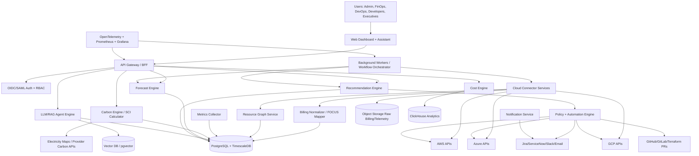

## 12.2 Microservices

| Component | Why it exists | Key responsibilities |
|---|---|---|
| API Gateway / BFF | Single secure entry point. | JWT validation, rate limiting, routing, request validation, audit correlation IDs. |
| Auth/RBAC Service | Multi-tenant security. | OIDC/SAML, SCIM, roles, permissions, cloud-account scopes. |
| Cloud Connectors | Provider data ingestion. | AWS CUR/Cost Explorer/CloudWatch/Compute Optimizer/Trusted Advisor/Sustainability; Azure Cost Management/Advisor/Resource Graph/Monitor; GCP Billing BigQuery/Recommender/Monitoring/Carbon Footprint. |
| Billing Normalizer | Multi-cloud billing needs common schema. | Map provider billing to FOCUS-like normalized model. |
| Resource Graph Service | Recommendations need dependencies and ownership. | Build graph of accounts, subscriptions, projects, resources, tags, Kubernetes objects, workloads. |
| Cost Engine | Computes spend, savings, unit economics. | Amortization, discount allocation, showback/chargeback, cost per customer/feature/request. |
| Carbon Engine | Computes operational/embodied carbon and SCI. | Provider emissions ingestion, Electricity Maps integration, SCI per functional unit, data-quality scoring. |
| Metrics Collector | Usage and SLO telemetry. | Cloud metrics, Prometheus/OpenTelemetry, Kubernetes metrics, Kepler power metrics. |
| Forecast Engine | Proactive cost/resource predictions. | Time-series forecasting, uncertainty intervals, seasonality, model drift. |
| Recommendation Engine | Converts analysis to actions. | Rightsizing, scheduling, idle cleanup, commitment plans, spot suitability, storage tiering, carbon-aware schedules. |
| AI/RAG Agent Engine | Evidence-grounded assistant and workflow planner. | Retrieve cloud docs/policies/evidence, explain recommendations, draft IaC PRs/tickets. |
| Policy + Automation Engine | Safe execution. | Approval gates, dry-run, PR creation, API changes, rollback, Cloud Custodian-like policies. |
| Notification Service | Drives action. | Slack, Teams, email, Jira, ServiceNow alerts and digests. |
| Background Workers | Asynchronous jobs. | Scheduled syncs, ETL, model training, report generation. |
| Observability | Operability and trust. | Metrics, logs, traces, recommendation audit logs. |

## 12.3 Security Architecture

- Tenant isolation at database, object storage, and encryption boundaries.
- Cloud access through least-privilege cross-account roles/service principals/workload identity.
- Secrets stored in KMS/Vault, never in application tables.
- Write actions disabled by default; automation requires explicit policy, approval, and audit.
- Support data minimization: ingest metadata/metrics/billing, not customer application data unless explicitly required.
- Immutable audit logs for all recommendations, approvals, and executions.

---

# 13. Research Question 10 — Database Design and ER Diagram

## 13.1 Database Strategy

- **PostgreSQL:** transactional data, tenants, users, resources, recommendations, approvals, policies.
- **TimescaleDB extension or hypertables:** time-series resource metrics, cost aggregates, carbon intensity.
- **ClickHouse:** high-volume cost analytics and billing line-item queries.
- **Object storage:** raw CUR exports, Azure exports, GCP BigQuery extracts, provider carbon reports.
- **pgvector / vector DB:** RAG document embeddings.
- **Redis:** caching, rate limits, job queues.

## 13.2 ER Diagram

```mermaid
erDiagram
  TENANT ||--o{ USER : has
  TENANT ||--o{ BUSINESS_UNIT : owns
  TENANT ||--o{ CLOUD_ACCOUNT : connects
  TENANT ||--o{ BUDGET : defines
  TENANT ||--o{ AUTOMATION_POLICY : defines
  USER ||--o{ USER_ROLE : assigned
  ROLE ||--o{ USER_ROLE : grants
  CLOUD_ACCOUNT ||--o{ CLOUD_CREDENTIAL : uses
  CLOUD_ACCOUNT ||--o{ CLOUD_RESOURCE : contains
  CLOUD_ACCOUNT ||--o{ COST_LINE_ITEM : bills
  CLOUD_ACCOUNT ||--o{ COMMITMENT : has
  CLOUD_RESOURCE ||--o{ RESOURCE_TAG : has
  TAG ||--o{ RESOURCE_TAG : labels
  CLOUD_RESOURCE ||--o{ RESOURCE_METRIC : emits
  CLOUD_RESOURCE ||--o{ CARBON_EMISSION : causes
  CLOUD_RESOURCE ||--o{ RECOMMENDATION : target
  CLOUD_RESOURCE ||--o{ WORKLOAD_RESOURCE : maps
  WORKLOAD ||--o{ WORKLOAD_RESOURCE : includes
  WORKLOAD ||--o{ SCI_SCORE : measured_by
  WORKLOAD ||--o{ FORECAST_RUN : forecasts
  COST_LINE_ITEM }o--|| COST_DAILY_AGGREGATE : aggregates_to
  CARBON_INTENSITY ||--o{ CARBON_EMISSION : factor_for
  RECOMMENDATION ||--o{ RECOMMENDATION_ACTION : contains
  RECOMMENDATION ||--o{ APPROVAL : requires
  RECOMMENDATION ||--o{ EVIDENCE_LINK : supported_by
  RECOMMENDATION ||--o{ AUTOMATION_EXECUTION : executes
  AUTOMATION_POLICY ||--o{ AUTOMATION_EXECUTION : governs
  AUTOMATION_EXECUTION ||--o{ AUDIT_LOG : records
  ANOMALY ||--o{ NOTIFICATION : triggers
  USER ||--o{ APPROVAL : approves

  TENANT {
    uuid tenant_id PK
    string name
    string plan
    timestamp created_at
  }
  USER {
    uuid user_id PK
    uuid tenant_id FK
    string email
    string display_name
    string status
  }
  ROLE {
    uuid role_id PK
    string name
    json permissions
  }
  USER_ROLE {
    uuid user_id FK
    uuid role_id FK
  }
  BUSINESS_UNIT {
    uuid business_unit_id PK
    uuid tenant_id FK
    string name
    uuid parent_id FK
  }
  CLOUD_ACCOUNT {
    uuid cloud_account_id PK
    uuid tenant_id FK
    string provider
    string external_account_id
    string name
    string status
  }
  CLOUD_CREDENTIAL {
    uuid credential_id PK
    uuid cloud_account_id FK
    string auth_type
    string secret_ref
    timestamp last_rotated_at
  }
  CLOUD_RESOURCE {
    uuid resource_id PK
    uuid cloud_account_id FK
    string provider_resource_id
    string resource_type
    string region
    string lifecycle_state
    uuid business_unit_id FK
    timestamp first_seen_at
    timestamp last_seen_at
  }
  TAG {
    uuid tag_id PK
    uuid tenant_id FK
    string key
    string value
  }
  RESOURCE_TAG {
    uuid resource_id FK
    uuid tag_id FK
    string source
  }
  RESOURCE_METRIC {
    uuid metric_id PK
    uuid resource_id FK
    timestamp ts
    string metric_name
    double value
    string unit
  }
  COST_LINE_ITEM {
    uuid cost_line_item_id PK
    uuid cloud_account_id FK
    uuid resource_id FK
    date charge_date
    string provider_service
    decimal billed_cost
    decimal effective_cost
    string currency
    json raw_ref
  }
  COST_DAILY_AGGREGATE {
    uuid aggregate_id PK
    uuid tenant_id FK
    date date
    string dimension_type
    string dimension_id
    decimal cost
    string currency
  }
  CARBON_INTENSITY {
    uuid intensity_id PK
    string zone
    timestamp ts
    double gco2e_per_kwh
    string method
    string source
    double confidence
  }
  CARBON_EMISSION {
    uuid emission_id PK
    uuid resource_id FK
    uuid intensity_id FK
    timestamp ts
    double energy_kwh
    double operational_gco2e
    double embodied_gco2e
    string method
    double confidence
  }
  WORKLOAD {
    uuid workload_id PK
    uuid tenant_id FK
    string name
    string type
    uuid owner_business_unit_id FK
    string criticality
    json slo
  }
  WORKLOAD_RESOURCE {
    uuid workload_id FK
    uuid resource_id FK
    double allocation_ratio
  }
  SCI_SCORE {
    uuid sci_score_id PK
    uuid workload_id FK
    timestamp period_start
    timestamp period_end
    string functional_unit
    double functional_units
    double sci_gco2e_per_unit
    string method
  }
  FORECAST_RUN {
    uuid forecast_run_id PK
    uuid workload_id FK
    timestamp created_at
    string target_metric
    string model_name
    json prediction_interval
    double confidence
  }
  RECOMMENDATION {
    uuid recommendation_id PK
    uuid tenant_id FK
    uuid resource_id FK
    string category
    string title
    string status
    decimal estimated_monthly_savings
    double estimated_gco2e_savings
    double risk_score
    double confidence
  }
  RECOMMENDATION_ACTION {
    uuid action_id PK
    uuid recommendation_id FK
    string action_type
    json parameters
    string execution_mode
  }
  AUTOMATION_POLICY {
    uuid policy_id PK
    uuid tenant_id FK
    string name
    string scope
    json guardrails
    bool enabled
  }
  APPROVAL {
    uuid approval_id PK
    uuid recommendation_id FK
    uuid approver_user_id FK
    string decision
    string comment
    timestamp decided_at
  }
  AUTOMATION_EXECUTION {
    uuid execution_id PK
    uuid recommendation_id FK
    uuid policy_id FK
    string status
    timestamp started_at
    timestamp finished_at
    json result
  }
  ANOMALY {
    uuid anomaly_id PK
    uuid tenant_id FK
    string metric_type
    string dimension
    timestamp detected_at
    double severity
    string status
  }
  NOTIFICATION {
    uuid notification_id PK
    uuid anomaly_id FK
    string channel
    string status
    timestamp sent_at
  }
  EVIDENCE_LINK {
    uuid evidence_id PK
    uuid recommendation_id FK
    string source_type
    string url
    string summary
  }
  AUDIT_LOG {
    uuid audit_id PK
    uuid tenant_id FK
    uuid actor_user_id FK
    string action
    string object_type
    uuid object_id
    timestamp ts
    json metadata
  }
  COMMITMENT {
    uuid commitment_id PK
    uuid cloud_account_id FK
    string provider_type
    string term
    decimal hourly_commitment
    timestamp start_at
    timestamp end_at
    double utilization
  }
  BUDGET {
    uuid budget_id PK
    uuid tenant_id FK
    string scope
    decimal amount
    string currency
    string period
  }
```

## 13.3 Normalization

- Third normal form for tenant, user, role, cloud account, resource, tag, and recommendation entities.
- Fact-style tables for `cost_line_item`, `resource_metric`, and `carbon_emission` to support analytics.
- Aggregates are derived and should be recomputable from raw cost/emission facts.
- Raw provider data is retained in object storage for audit and recalculation.

---

# 14. Research Question 11 — UML Diagrams

## 14.1 Use Case Diagram

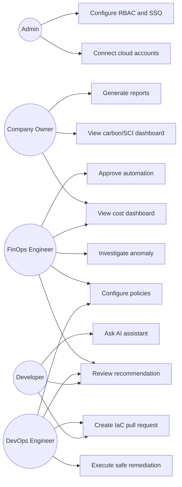

**Explanation:** This diagram shows GreenCloud AI as a collaboration platform. Admins connect accounts and configure access. FinOps owns visibility and governance. DevOps executes controlled changes. Developers receive recommendation context and PRs. Company owners consume reports.

## 14.2 Class Diagram

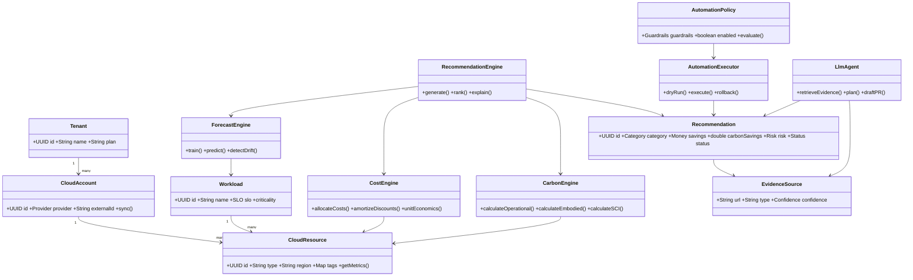

**Explanation:** This class diagram separates domain entities from decision engines. Recommendations are not just text; they carry savings, carbon impact, risk, status, and evidence.

## 14.3 Activity Diagram — Optimization Workflow

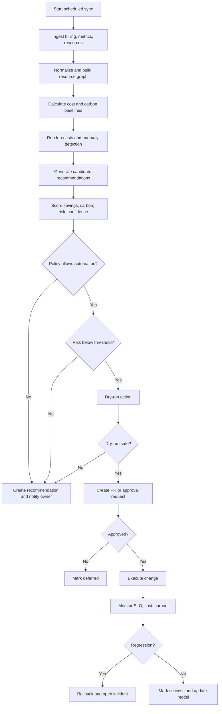

**Explanation:** The workflow is intentionally human-in-the-loop for risk. Even allowed automation must pass policy, risk, dry-run, approval, and post-change monitoring.

## 14.4 Sequence Diagram — Recommendation Execution

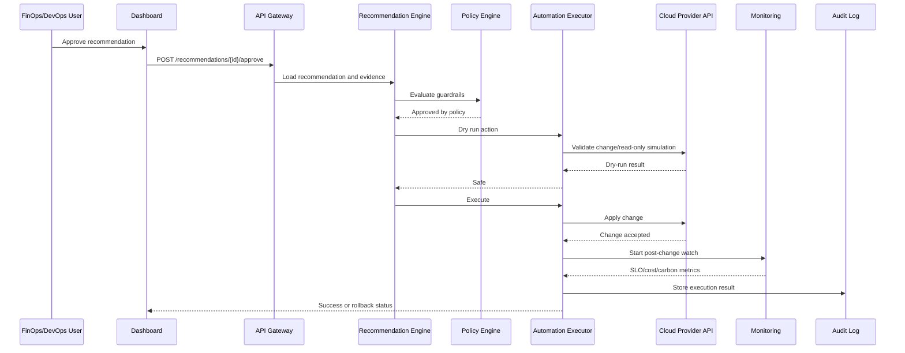

**Explanation:** The sequence emphasizes auditability and rollback monitoring.

## 14.5 Component Diagram

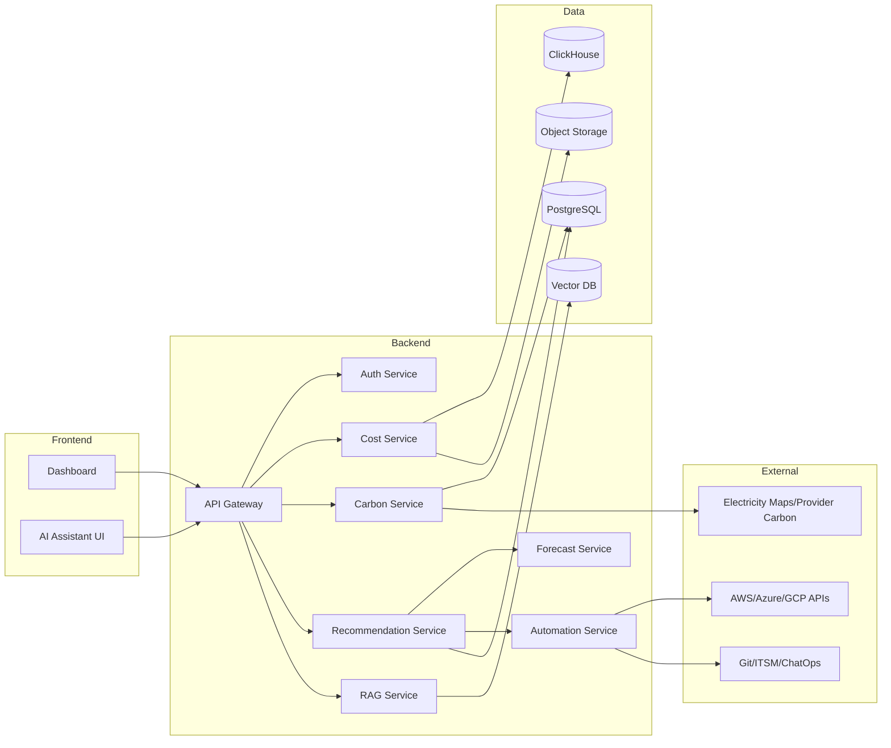

**Explanation:** Components are isolated so carbon, cost, forecast, recommendations, and automation can evolve independently.

## 14.6 Deployment Diagram

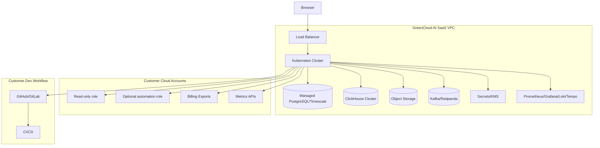

**Explanation:** Deployment is SaaS-first but can support private deployment for regulated customers.

## 14.7 State Diagram — Recommendation Lifecycle

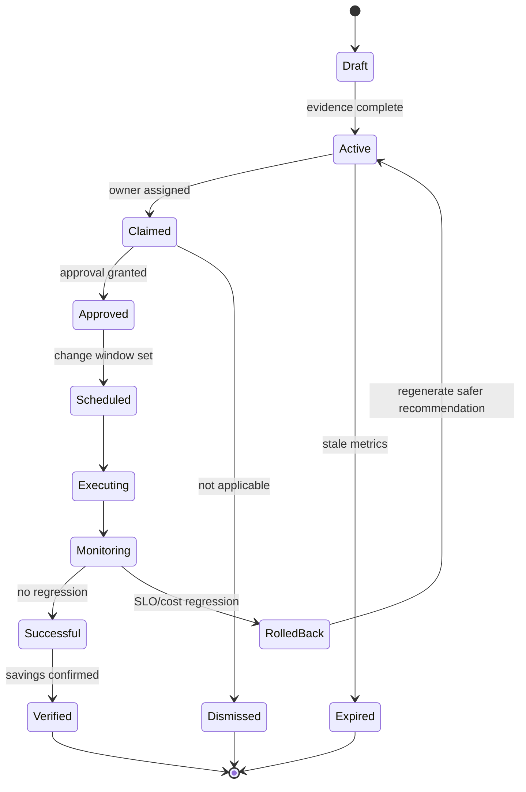

**Explanation:** Recommendations are first-class lifecycle objects, not one-time alerts.

---

# 15. Research Question 12 — System Design and DFDs

## 15.1 Context Diagram

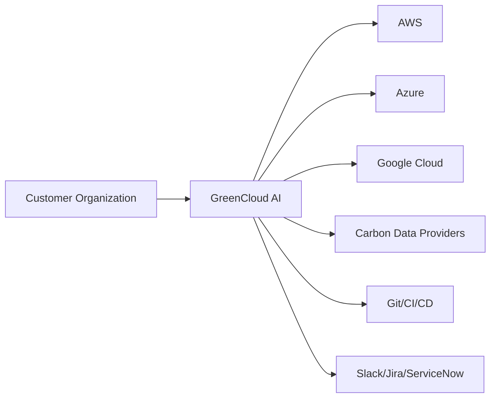

## 15.2 DFD Level 0

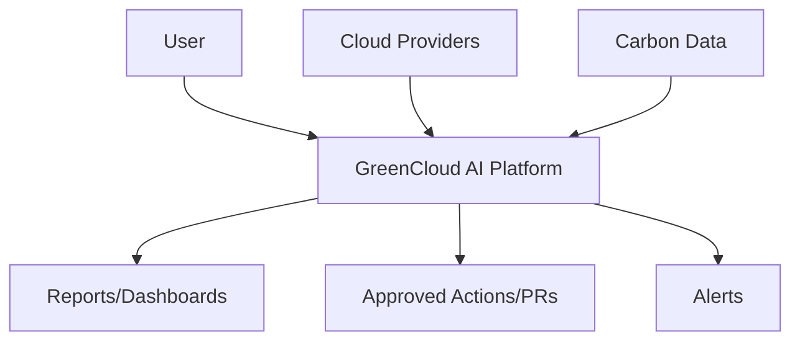

## 15.3 DFD Level 1

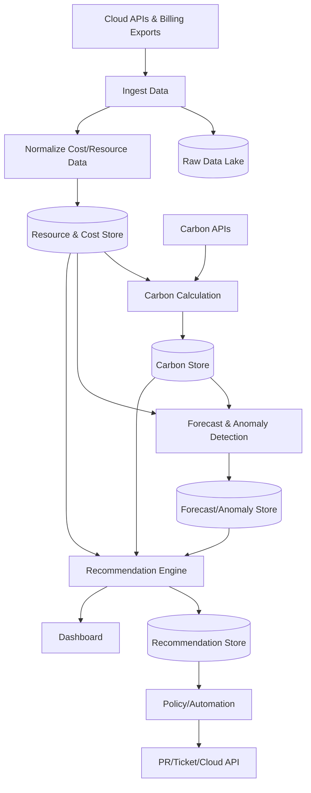

## 15.4 DFD Level 2 — Optimization Flow

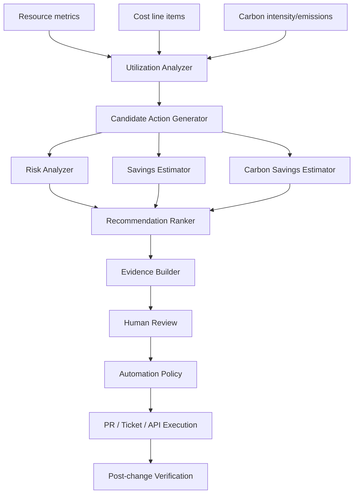

## 15.5 Data Flow

1. Cloud billing and usage exports are ingested into object storage.
2. Billing is normalized into FOCUS-like cost records.
3. Resource inventory and metrics build a time-aware resource graph.
4. Carbon engine maps energy/use to carbon intensity and embodied estimates.
5. Forecast engine predicts demand and confidence intervals.
6. Recommendation engine ranks actions by savings, carbon reduction, confidence, and risk.
7. Policy engine creates ticket/PR/API execution.
8. Verification loop measures actual cost/carbon/SLO outcome.

## 15.6 API Flow

1. Client authenticates through OIDC/SAML.
2. API Gateway validates JWT, tenant, and RBAC.
3. Request routes to domain service.
4. Domain service checks object-level permissions.
5. Response includes evidence, confidence, and audit ID.

## 15.7 Cloud Resource Flow

1. Cloud account connected with read-only role.
2. Optional automation role added separately.
3. Inventory scans resources.
4. Metrics and billing attach to resources.
5. Resource graph maps workloads and owners.

## 15.8 Optimization Flow

1. Detect opportunity.
2. Estimate cost/carbon/SLO impact.
3. Attach evidence and confidence.
4. Apply policy and approval.
5. Execute via PR/ticket/API.
6. Verify and learn.

## 15.9 AI Decision Flow

1. Retrieve relevant evidence: provider docs, internal policies, telemetry, previous outcomes.
2. Generate candidate action.
3. Score with deterministic cost/carbon models.
4. Use LLM only for explanation, planning, and workflow drafting unless constrained by tools.
5. Require policy approval for execution.

---

# 16. Research Question 13 — API Design

## 16.1 API Principles

- RESTful JSON over HTTPS.
- OAuth2/OIDC JWT bearer tokens.
- Optional service API keys for CI/CD integrations.
- Tenant ID resolved from token, not request body.
- All write/execute endpoints are idempotent via `Idempotency-Key`.
- Every response includes `request_id`.
- Errors follow a standard envelope.

## 16.2 Error Envelope

```json
{
  "error": {
    "code": "VALIDATION_ERROR",
    "message": "Invalid time range",
    "details": [{"field": "end_date", "issue": "must be after start_date"}],
    "request_id": "req_123"
  }
}
```

Common status codes: `400`, `401`, `403`, `404`, `409`, `422`, `429`, `500`, `503`.

## 16.3 Core REST APIs

| Endpoint | Method | Purpose | Request example | Response example | Auth |
|---|---|---|---|---|---|
| `/v1/cloud-accounts` | POST | Connect cloud account | `{ "provider":"aws", "external_account_id":"123", "role_arn":"arn:..." }` | `{ "cloud_account_id":"uuid", "status":"pending_validation" }` | Admin |
| `/v1/cloud-accounts/{id}/sync` | POST | Trigger sync | `{ "sync_type":"billing_and_inventory" }` | `{ "job_id":"uuid" }` | Admin/FinOps |
| `/v1/resources` | GET | List resources | query: `provider=aws&region=us-east-1` | `{ "items":[...] }` | Reader |
| `/v1/costs/summary` | GET | Cost summary | query: `start,end,group_by=service` | `{ "total":1234.56, "currency":"USD", "series":[...] }` | Reader |
| `/v1/carbon/summary` | GET | Carbon summary | query: `method=sci&group_by=workload` | `{ "total_gco2e":12345, "by_workload":[...] }` | Reader |
| `/v1/sci-scores` | GET | SCI per workload | query: `functional_unit=request` | `{ "items":[{"workload":"api", "sci":0.02}] }` | Reader |
| `/v1/forecasts` | POST | Create forecast | `{ "target":"cost", "scope":"workload:uuid", "horizon_days":30 }` | `{ "forecast_run_id":"uuid" }` | FinOps |
| `/v1/anomalies` | GET | List anomalies | query: `status=active` | `{ "items":[...] }` | Reader |
| `/v1/anomalies/{id}` | PATCH | Update anomaly state | `{ "status":"resolved", "comment":"expected launch" }` | `{ "status":"resolved" }` | FinOps |
| `/v1/recommendations` | GET | List recommendations | query: `category=rightsizing&min_confidence=.8` | `{ "items":[...] }` | Reader |
| `/v1/recommendations/{id}` | GET | Recommendation detail | none | `{ "title":"Downsize EC2", "evidence":[...], "risk_score":0.2 }` | Reader |
| `/v1/recommendations/{id}/approve` | POST | Approve | `{ "decision":"approved", "change_window":"2026-08-02T02:00Z" }` | `{ "status":"approved" }` | Approver |
| `/v1/recommendations/{id}/execute` | POST | Execute | `{ "mode":"pull_request" }` | `{ "execution_id":"uuid", "status":"scheduled" }` | DevOps/Admin |
| `/v1/automation-policies` | POST | Create policy | `{ "name":"stop-dev-after-hours", "guardrails":{...} }` | `{ "policy_id":"uuid" }` | Admin |
| `/v1/budgets` | POST | Create budget | `{ "scope":"business_unit:uuid", "amount":10000, "period":"monthly" }` | `{ "budget_id":"uuid" }` | FinOps |
| `/v1/notifications/channels` | POST | Configure Slack/Jira/email | `{ "type":"slack", "webhook_secret_ref":"vault://..." }` | `{ "channel_id":"uuid" }` | Admin |
| `/v1/assistant/query` | POST | RAG assistant | `{ "question":"Why is EC2 cost up?", "scope":"team:payments" }` | `{ "answer":"...", "citations":[...] }` | Reader |
| `/v1/reports/export` | POST | Export report | `{ "type":"monthly_finops_greenops", "format":"pdf" }` | `{ "job_id":"uuid" }` | Reader |
| `/v1/webhooks/cloud-events` | POST | Receive event | provider-specific | `{ "accepted":true }` | Signed webhook |

## 16.4 Validation Rules

- Date ranges cannot exceed plan limits.
- Automation execution requires recommendation status `approved` or matching auto-policy.
- Write actions require automation role configured and least-privilege permission check.
- Carbon SCI request must specify functional unit and boundary.
- Forecast horizon limited by available historical data.

---

# 17. Research Question 14 — User Stories

## Admin

- As an Admin, I want to connect AWS/Azure/GCP accounts using least-privilege credentials so that GreenCloud AI can ingest billing and resource metadata.
- As an Admin, I want SSO, SCIM, and RBAC so that access follows enterprise identity policy.
- As an Admin, I want immutable audit logs so that all recommendations and changes can be reviewed.

## Company Owner / Executive

- As a Company Owner, I want monthly cost, savings, carbon, and SCI reports so that I can track business value and sustainability progress.
- As a Company Owner, I want unit cost and unit carbon trends so that I can understand margin and emissions per customer/product.

## Developer

- As a Developer, I want pull-request comments showing cost and carbon impact so that I can fix waste before deployment.
- As a Developer, I want explanations with evidence so that I trust recommendations.

## FinOps Engineer

- As a FinOps Engineer, I want cost allocation by team/product/environment so that I can run showback and chargeback.
- As a FinOps Engineer, I want anomaly detection and root cause so that I can respond before month-end.
- As a FinOps Engineer, I want commitment simulations so that I do not overcommit.

## DevOps Engineer

- As a DevOps Engineer, I want safe automation policies so that low-risk changes can be executed with guardrails.
- As a DevOps Engineer, I want rollback and post-change monitoring so that optimization does not break SLOs.

---

# 18. Research Question 15 — Functional Requirements

| ID | Requirement |
|---|---|
| FR-001 | Connect AWS, Azure, and Google Cloud accounts using least-privilege credentials. |
| FR-002 | Ingest billing, resource inventory, utilization metrics, recommendations, and carbon reports. |
| FR-003 | Normalize cost data using a FOCUS-compatible internal schema. |
| FR-004 | Build a resource graph with account, region, resource, Kubernetes workload, tags, and owners. |
| FR-005 | Detect idle resources across compute, storage, databases, load balancers, NAT gateways, and IPs. |
| FR-006 | Generate rightsizing recommendations for VMs, containers, storage, databases, and serverless where telemetry supports it. |
| FR-007 | Generate scheduling/parking recommendations for non-production and flexible workloads. |
| FR-008 | Simulate Reserved Instance/Savings Plan/CUD coverage and utilization scenarios. |
| FR-009 | Detect cost anomalies and carbon anomalies. |
| FR-010 | Forecast cost, demand, and resource utilization with confidence intervals. |
| FR-011 | Calculate operational carbon, embodied carbon estimates, and SCI per functional unit. |
| FR-012 | Integrate Electricity Maps or similar carbon-intensity provider. |
| FR-013 | Rank recommendations by cost savings, carbon savings, risk, confidence, and effort. |
| FR-014 | Provide evidence and source traceability for recommendations. |
| FR-015 | Support approval workflows for high-risk actions. |
| FR-016 | Create Jira/ServiceNow tickets and GitHub/GitLab pull requests. |
| FR-017 | Execute approved low-risk changes through cloud APIs where configured. |
| FR-018 | Monitor post-change SLO/cost/carbon outcomes and rollback when required. |
| FR-019 | Provide dashboards for cost, carbon, SCI, utilization, anomalies, budgets, and recommendation status. |
| FR-020 | Provide RAG assistant for FinOps/GreenOps questions with citations. |
| FR-021 | Export reports as PDF/CSV/JSON. |
| FR-022 | Maintain immutable audit logs. |

---

# 19. Research Question 16 — Non-Functional Requirements

| Category | Requirement |
|---|---|
| Performance | Dashboard queries for common aggregates should return within 2 seconds for cached data; large analytical queries should be asynchronous. This is a product target, not a published benchmark. |
| Scalability | Architecture must support millions of resources and billions of billing/metric rows by separating OLTP, OLAP, and object storage. |
| Reliability | Ingestion jobs must be idempotent and resumable; raw billing files must be immutable. |
| Availability | SaaS control plane target should be at least 99.9% after production maturity. This is a design target, not evidence from sources. |
| Security | Least privilege, tenant isolation, encryption in transit/at rest, KMS/Vault secrets, RBAC, audit logs. |
| Maintainability | Domain services, typed schemas, contract tests for provider adapters, IaC-managed infrastructure. |
| Accessibility | WCAG 2.1 AA target for dashboards and reports. |
| Data governance | Retention controls, PII minimization, data residency options, customer-managed keys for enterprise. |
| Explainability | Every recommendation must include input metrics, assumptions, confidence, evidence links, and rollback plan. |
| Observability | OpenTelemetry traces, Prometheus metrics, centralized logs, SLOs for ingestion latency and recommendation freshness. |

---

# 20. Research Question 17 — Complete Technology Stack

## 20.1 Recommended Stack

| Layer | Recommended technology | Why chosen | Alternatives | Evidence / Notes |
|---|---|---|---|---|
| Frontend | React + TypeScript + Next.js | Mature dashboard ecosystem, strong typing, SSR for reports. | Vue/Nuxt, SvelteKit. | Engineering choice; no external claim. |
| API | Go or Java/Kotlin for core APIs; Python FastAPI for AI services | Go efficient for connectors/workers; Python strong ML ecosystem. | Node.js, Rust. | Engineering choice. |
| Workflow | Temporal | Durable workflows for syncs and automation. | Airflow, Argo Workflows, Step Functions. | Engineering choice. |
| OLTP DB | PostgreSQL + TimescaleDB | Strong relational model + time-series extension. | MySQL, CockroachDB. | Engineering choice. |
| OLAP | ClickHouse | Efficient analytical queries on billing line items. | BigQuery, Snowflake, DuckDB. | Engineering choice. |
| Raw data | S3/GCS/Azure Blob-compatible object storage | Immutable raw billing and reports. | MinIO, HDFS. | Engineering choice. |
| Queue/stream | Kafka/Redpanda | Event streaming for ingestion and anomaly events. | NATS, RabbitMQ, Pub/Sub/SQS. | Engineering choice. |
| Cache | Redis | Rate limits, job state, query cache. | Memcached, KeyDB. | Engineering choice. |
| Vector store | pgvector initially; Weaviate/Qdrant later | Simpler ops in PostgreSQL; upgrade path for scale. | Pinecone, OpenSearch vector. | Engineering choice. |
| ML/forecasting | scikit-learn, StatsForecast, Prophet, PyTorch | Baselines + deep learning; uncertainty support. | TensorFlow, GluonTS. | Supported by forecasting literature [2](https://link.springer.com/article/10.1186/s13677-019-0128-9), [10](https://link.springer.com/article/10.1007/s10586-024-04933-2). |
| Carbon data | Electricity Maps + provider carbon APIs + CCF method | Hourly/forecast carbon intensity and multi-cloud estimates. | WattTime, Climatiq. | Electricity Maps docs [1](https://portal.electricitymaps.com/docs), CCF docs [2](https://www.cloudcarbonfootprint.org/docs/methodology/). |
| Kubernetes cost | OpenCost integration | OSS cost allocation standard for K8s. | Kubecost commercial, cloud provider allocation. | OpenCost docs [1](https://opencost.io/docs/). |
| Energy telemetry | Kepler | K8s power metrics via eBPF/Prometheus. | RAPL custom exporters, cloud provider estimates. | Kepler package docs [2](https://pkg.go.dev/github.com/sustainable-computing-io/kepler). |
| Policy | OPA/Rego + Cloud Custodian-inspired YAML | Policy-as-code and governance automation. | Cedar, Kyverno, Sentinel. | Cloud Custodian docs [2](https://cloudcustodian.io/docs/overview.html). |
| Auth | Keycloak/Auth0/Okta OIDC/SAML | Enterprise SSO. | AWS Cognito, Azure AD B2C. | Engineering choice. |
| Observability | OpenTelemetry + Prometheus + Grafana + Loki/Tempo | Cloud-native observability. | Datadog, New Relic. | CNCF ecosystem. |
| IaC | Terraform/OpenTofu + Helm | Cloud provider automation and PR remediation. | Pulumi, Crossplane. | Engineering choice. |

## 20.2 Build-vs-Buy Recommendations

- **Use OpenCost rather than rebuilding Kubernetes allocation from scratch.**
- **Use provider-native recommendations as signals, not the sole engine.** AWS/Azure/GCP recommendations are high-confidence within a cloud but are provider-specific.
- **Build GreenCloud AI’s differentiating layer:** cross-cloud normalization, SCI, carbon-aware scheduling, confidence scoring, and safe automation.

---

# 21. Research Question 18 — Risks

| Risk category | Risk | Mitigation |
|---|---|---|
| Technical | Provider APIs change or rate-limit ingestion. | Adapter abstraction, retries, contract tests, provider schema versioning. |
| Technical | Billing data is delayed or incomplete. | Track freshness; display data quality; raw data replay. |
| Technical | Recommendations cause performance degradation. | SLO guardrails, dry-runs, canaries, rollback, approval workflows. |
| Business | Competitors already have strong cost platforms. | Differentiate with GreenOps, SCI, carbon-aware automation, evidence quality. |
| Security | Cloud credentials abused. | Least privilege, read-only default, optional write role, KMS/Vault, audit logs. |
| AI | LLM hallucination or unsafe action. | RAG citations, tool constraints, no direct execution without policy/approval. |
| Legal | Carbon reports used for regulatory disclosures may be inaccurate. | Label estimates, show methodology, data provenance, confidence, export audit trail; avoid assurance claims. |
| Vendor lock-in | Provider-specific APIs and pricing models. | FOCUS schema, adapter pattern, open standards, raw data ownership. |
| Data privacy | Billing/resource metadata can reveal business operations. | Encryption, tenant isolation, data minimization, enterprise data residency. |
| Carbon accounting | Provider methodologies disagree. | Multi-method reporting; disclose boundaries and limitations. |
| Market | Customers may want savings guarantees. | Conservative claims; measure verified savings post-action. |

---

# 22. Research Question 19 — Innovative Features That Are Justified by Evidence

## 22.1 Feature Ideas

| Feature | Evidence justification | Why it may be differentiated | Evidence gap / caution |
|---|---|---|---|
| Workload-level SCI dashboard | SCI defines carbon per functional unit and requires boundaries/method disclosure [5](https://sci.greensoftware.foundation/). | Moves beyond total cloud emissions to engineering-actionable unit carbon. | Public competitor evidence for workload-level SCI not found. |
| Cost + carbon recommendation ranking | Cost and carbon are related but not identical; Google recommends dual accounting and correlating carbon with cost [4](https://docs.cloud.google.com/architecture/framework/sustainability/continuously-measure-improve). | Optimizes for business and sustainability simultaneously. | Need careful trade-off UI; not all carbon reductions save money. |
| Carbon-aware batch scheduler | GreenSlot, Google carbon-aware computing, and CarbonScaler show emissions reductions for flexible workloads [2](https://www.semanticscholar.org/paper/GreenSlot:-Scheduling-energy-consumption-in-green-Goiri-Beauchea/64fb450f92808364050b729e24a92583971208b7), [9](https://luiscruz.github.io/green-ai/publications/2021-07-radovanovic-carbon.html), [2](https://par.nsf.gov/biblio/10496892). | GreenCloud AI can schedule CI, ML training, ETL, and batch jobs by carbon forecast. | Works mainly for flexible workloads. |
| Carbon data quality score | Google notes customer carbon reports are not assured [1](https://docs.cloud.google.com/carbon-footprint/docs/methodology); CCF says estimates lack confidence intervals [2](https://www.cloudcarbonfootprint.org/docs/methodology/). | Builds trust by showing method, source, granularity, scope, confidence. | Requires ongoing methodology governance. |
| IaC remediation PRs with cost and SCI delta | Community HN evidence shows desire for proactive PR cost controls [4](https://news.ycombinator.com/item?id=37062007); Cloud Custodian validates policy-as-code [2](https://cloudcustodian.io/docs/overview.html). | Shifts optimization left and prevents drift. | Cost estimates for usage-based services can be uncertain. |
| Recommendation safety contracts | Google Recommender has multiple impact categories [3](https://docs.cloud.google.com/recommender/docs/key-concepts); Autopilot reduced waste while managing OOM risk [10](https://www.semanticscholar.org/paper/Autopilot:-workload-autoscaling-at-Google-Rz%C4%85dca-Findeisen/f1fe5a8700e7c915a7e58dd69bd0e397f6d0a316). | Each action ships with SLO guardrail, rollback, and contraindications. | Requires high-quality telemetry. |
| AI workload cost+carbon unit economics | Harness and CloudZero track AI spend [3](https://developer.harness.io/docs/cloud-cost-management/get-started/overview/), [4](https://docs.cloudzero.com/docs/cloudzero); Strubell/Patterson show AI training emissions matter [4](https://arxiv.org/abs/1906.02243), [5](https://arxiv.org/abs/2104.10350). | Adds carbon per inference/training run and optimization policies. | Token/provider data and GPU telemetry must be integrated. |
| Recommendation debt tracker | FinOps Framework includes governance, policy, automation, and practice operations [1](https://www.finops.org/framework/). | Tracks stale/deferred savings like security debt. | Needs organizational adoption. |

**Important:** These are product suggestions justified by evidence. Public evidence was not sufficient to claim with certainty that no competitor offers any version of each feature privately. The correct claim is: **evidence was not found in reviewed public sources for full multi-cloud cost+carbon+SCI automation with evidence-quality scoring.**

---

# 23. Research Findings

1. **Cloud cost optimization is already well understood at the tactic level**: rightsizing, idle cleanup, reservations, Savings Plans/CUDs, Spot, autoscaling, scheduling, storage/database/network optimization.
2. **The unsolved problem is operational integration**: companies struggle to connect visibility, ownership, forecasting, safe automation, and sustainability.
3. **Carbon accounting is less mature than cost accounting**: SCI provides a strong standard, but cloud data quality and provider methodology differences remain major limitations.
4. **AI is useful, but not as magic automation**: forecasting, anomaly detection, recommendation ranking, RAG explanations, and controlled agents are justified; unsupervised execution is risky.
5. **Kubernetes is a major opportunity** because cost is billed at infrastructure level but engineering works at workload level.
6. **Open standards matter**: FOCUS for cost normalization and SCI for carbon intensity can form GreenCloud AI’s trust layer.
7. **A competitive product must be action-oriented**: dashboards alone are not enough; PRs, tickets, policy-as-code, and safe cloud API automation are necessary.

---

# 24. Research Gaps

| Gap | Evidence |
|---|---|
| Standardized real-time multi-cloud carbon telemetry | GSF SCI notes granular data can be unavailable in public cloud [5](https://sci.greensoftware.foundation/); GSF real-time cloud project seeks standardized cloud-region metadata [1](https://github.com/Green-Software-Foundation/real-time-cloud). |
| Confidence intervals for cloud carbon estimates | Cloud Carbon Footprint states it uses point estimates without confidence intervals [2](https://www.cloudcarbonfootprint.org/docs/methodology/). |
| Production evidence for multi-cloud carbon-aware scheduling | Strong research exists, but public evidence for mainstream commercial multi-cloud automation is limited. |
| Safe fully autonomous cost optimization | Tools automate some actions, but academic and provider evidence supports guardrails due to SLO/performance risk. |
| Unified AI-cost and AI-carbon accounting | AI cost tools are emerging; emissions per inference/training are still methodologically evolving. |
| Business-context allocation without tags | CloudZero claims 100% allocation including untagged costs [5](https://www.cloudzero.com/blog/cloud-cost-optimization/), but generalizable open methods are not standardized. |

---

# 25. Future Work

## 25.1 Research Work

- Conduct a formal PRISMA-style systematic review with database queries in IEEE/ACM/Springer/ScienceDirect.
- Benchmark forecasting models on public traces: Google Cluster, Alibaba Cluster, Azure traces, Bitbrains, NASA HTTP, WorldCup98.
- Evaluate carbon-aware scheduling on real batch workloads using Electricity Maps data.
- Compare provider carbon reports against SCI and CCF models.
- Study user workflows through interviews with FinOps, SRE, DevOps, and sustainability teams.

## 25.2 Product Work

- Build MVP with AWS + Kubernetes + Carbon Engine first.
- Add Azure/GCP after internal data model stabilizes.
- Use read-only recommendations before enabling automation.
- Add IaC PR remediation before direct cloud write actions.
- Create trust dashboard showing data freshness, source confidence, and recommendation verification.

## 25.3 MVP Scope Recommendation

**MVP 1:**

- AWS CUR ingestion.
- Kubernetes OpenCost integration.
- Resource inventory.
- Rightsizing + idle resources.
- Cost anomaly detection.
- Carbon estimate using SCI/CCF + Electricity Maps.
- Recommendation dashboard.
- Slack/Jira notifications.

**MVP 2:**

- Azure/GCP connectors.
- Forecasting.
- Carbon-aware batch scheduling.
- IaC PR remediation.
- RAG assistant.

**MVP 3:**

- Commitment optimizer.
- Spot suitability engine.
- Verified savings and carbon reports.
- AI workload token/GPU cost-carbon analytics.

---

# 26. References

## Peer-reviewed / Academic

1. Beloglazov, A., Buyya, R. (2010). *Energy Efficient Resource Management in Virtualized Cloud Data Centers*. IEEE/ACM CCGrid. [4](https://www.semanticscholar.org/paper/Energy-Efficient-Resource-Management-in-Virtualized-Beloglazov-Buyya/ea23c2b22698ad2f39c7b21dc43c8befa3f77bf5)
2. Beloglazov, A., Buyya, R., Lee, Y.C., Zomaya, A. (2011). *A Taxonomy and Survey of Energy-Efficient Data Centers and Cloud Computing Systems*. [2](https://arxiv.org/abs/1007.0066)
3. Hameed, A. et al. (2014). *A survey and taxonomy on energy efficient resource allocation techniques for cloud computing systems*. [1](https://link.springer.com/article/10.1007/s00607-014-0407-8)
4. Verma, A., Pedrosa, L., Korupolu, M., Oppenheimer, D., Tune, E., Wilkes, J. (2015). *Large-scale cluster management at Google with Borg*. EuroSys. [4](https://researchportal.ulisboa.pt/en/publications/large-scale-cluster-management-at-google-with-borg/)
5. Rządca, K. et al. (2020). *Autopilot: workload autoscaling at Google*. EuroSys. [10](https://www.semanticscholar.org/paper/Autopilot:-workload-autoscaling-at-Google-Rz%C4%85dca-Findeisen/f1fe5a8700e7c915a7e58dd69bd0e397f6d0a316)
6. Moreno-Vozmediano, R., Montero, R.S., Huedo, E., Llorente, I.M. (2019). *Efficient resource provisioning for elastic Cloud services based on machine learning techniques*. Journal of Cloud Computing. [2](https://link.springer.com/article/10.1186/s13677-019-0128-9)
7. Kumar, J., Singh, A.K. (2020). *Performance Assessment of Time Series Forecasting Models for Cloud Datacenter Networks’ Workload Prediction*. [6](https://link.springer.com/article/10.1007/s11277-020-07773-6)
8. Rossi, A. et al. (2025). *Forecasting workload in cloud computing: towards uncertainty-aware predictions and transfer learning*. [10](https://link.springer.com/article/10.1007/s10586-024-04933-2)
9. Chen, S., Lei, J., Moinzadeh, K. (2024). *Cost Optimization in Cloud Computing: Capacity Reservation for Intermittent Random Demand Surges*. [3](https://journals.sagepub.com/doi/10.1177/10591478241251614)
10. Liu, M., Pan, L., Liu, S. (2023). *Cost Optimization for Cloud Storage from User Perspectives*. ACM Computing Surveys. [4](https://dl.acm.org/doi/pdf/10.1145/3582883)
11. Goiri, Í. et al. (2011). *GreenSlot: Scheduling energy consumption in green datacenters*. SC. [2](https://www.semanticscholar.org/paper/GreenSlot:-Scheduling-energy-consumption-in-green-Goiri-Beauchea/64fb450f92808364050b729e24a92583971208b7)
12. Radovanovic, A. et al. (2021). *Carbon-Aware Computing for Datacenters*. [9](https://luiscruz.github.io/green-ai/publications/2021-07-radovanovic-carbon.html)
13. Hanafy, W.A., Liang, Q., Bashir, N., Irwin, D., Shenoy, P. (2023). *CarbonScaler*. ACM POMACS. [2](https://par.nsf.gov/biblio/10496892)
14. Strubell, E., Ganesh, A., McCallum, A. (2019). *Energy and Policy Considerations for Deep Learning in NLP*. ACL. [4](https://arxiv.org/abs/1906.02243)
15. Patterson, D. et al. (2021). *Carbon Emissions and Large Neural Network Training*. [5](https://arxiv.org/abs/2104.10350)
16. Yao, S. et al. (2023). *ReAct: Synergizing Reasoning and Acting in Language Models*. ICLR. [2](https://collaborate.princeton.edu/en/publications/react-synergizing-reasoning-and-acting-in-language-models/)
17. Lewis, P. et al. (2020). *Retrieval-Augmented Generation for Knowledge-Intensive NLP Tasks*. [1](https://www.researchgate.net/publication/341639856_Retrieval-Augmented_Generation_for_Knowledge-Intensive_NLP_Tasks)
18. Gu, Y. et al. (2025). *Deep Reinforcement Learning for Job Scheduling and Resource Management in Cloud Computing: An Algorithm-Level Review*. [5](https://arxiv.org/abs/2501.01007)

## Official Documentation / Standards

19. AWS Cost Optimization. [5](https://aws.amazon.com/aws-cost-management/cost-optimization/)
20. AWS Cost Optimization Hub strategies. [2](https://docs.aws.amazon.com/cost-management/latest/userguide/coh-optimization-strategies.html)
21. AWS Compute Optimizer pricing. [4](https://aws.amazon.com/compute-optimizer/pricing/)
22. AWS Trusted Advisor cost checks. [4](https://docs.aws.amazon.com/awssupport/latest/user/cost-optimization-checks.html)
23. Azure Advisor Cost Optimization workbook. [5](https://learn.microsoft.com/en-us/azure/advisor/advisor-workbook-cost-optimization)
24. Azure AKS cost optimization best practices. [2](https://learn.microsoft.com/en-us/azure/aks/best-practices-cost)
25. Google Cloud CUD recommendations. [1](https://docs.cloud.google.com/docs/cuds-recommender)
26. Google Cloud Recommender concepts. [3](https://docs.cloud.google.com/recommender/docs/key-concepts)
27. Google Cloud Carbon Footprint methodology. [1](https://docs.cloud.google.com/carbon-footprint/docs/methodology)
28. Green Software Foundation SCI specification. [5](https://sci.greensoftware.foundation/)
29. Electricity Maps API documentation. [1](https://portal.electricitymaps.com/docs)
30. Cloud Carbon Footprint methodology. [2](https://www.cloudcarbonfootprint.org/docs/methodology/)
31. FinOps Framework. [1](https://www.finops.org/framework/)
32. FOCUS specification. [1](https://focus.finops.org/)
33. OpenCost docs. [1](https://opencost.io/docs/)
34. Cloud Custodian docs. [2](https://cloudcustodian.io/docs/overview.html)
35. Carbon Aware SDK docs. [1](https://carbon-aware-sdk.greensoftware.foundation/)

## Competitor / Product Sources

36. CloudHealth by Broadcom solution brief. [1](https://cloudhealth.vmware.com/resources/solution-brief/partners-accelerate-your-cloud-business-power-cloudhealth.html)
37. CloudZero docs. [4](https://docs.cloudzero.com/docs/cloudzero)
38. CloudZero Intelligence press release. [1](https://www.cloudzero.com/press-releases/20241203/)
39. Kubecost cost-analyzer README. [2](https://github.com/kubecost/cost-analyzer/blob/gh-pages/README.md)
40. CAST AI pricing. [3](https://cast.ai/pricing/)
41. CAST AI AWS Marketplace listing. [4](https://aws.amazon.com/marketplace/pp/prodview-vtvxyzbzs3huy)
42. Harness CACM overview. [3](https://developer.harness.io/docs/cloud-cost-management/get-started/overview/)
43. Harness CACM subscription plans. [2](https://developer.harness.io/docs/cloud-cost-management/product-behaviour/)
44. Flexera Cloud Cost Optimization docs. [5](https://docs.flexera.com/flexera-one/partners/cloud-cost-optimization/)
45. IBM Turbonomic cloud optimization. [4](https://www.ibm.com/products/turbonomic/cloud-optimization)

## Community Sources Used Only for Pain Points

46. Hacker News Kubernetes cost discussion. [1](https://news.ycombinator.com/item?id=39589595)
47. Hacker News Infracost discussion. [4](https://news.ycombinator.com/item?id=37062007)
48. Hacker News proactive Kubernetes cost PR discussion. [3](https://news.ycombinator.com/item?id=46542480)
49. Reddit AWS cost reduction thread. [2](https://www.reddit.com/r/aws/comments/xwascc/reducing_aws_costs/)
50. Reddit AWS bill surprise thread. [3](https://www.reddit.com/r/aws/comments/1itu1tj/why_do_people_complain_about_unexpected_bump_in/)
51. Reddit AWS carbon footprint comparison thread. [2](https://www.reddit.com/r/aws/comments/xc98a9/aws_carbon_footprint_tool_vs_gcp_its_disappointing/)
52. Stack Overflow Kubernetes resource request waste. [1](https://stackoverflow.com/questions/67215134/high-total-cpu-request-but-low-total-usage-kubernetes-resources)
53. OpenCost issue on cost mismatch. [4](https://github.com/opencost/opencost/issues/2110)

---

## Final Note

Not enough published evidence was found for exact private architectures, proprietary algorithms, and current negotiated pricing of several commercial competitors. Those fields are intentionally marked as public-evidence gaps rather than guessed.
